# 6

# 评估会话管理机制

本章介绍了用于绕过和评估会话管理方案的技术。会话管理方案用于应用程序跟踪用户活动，通常通过会话令牌实现。Web 评估会话管理还涉及确定所用会话令牌的强度以及这些令牌是否得到了适当保护。我们将学习如何使用 Burp Suite 执行这些测试。

在本章中，我们将介绍以下实验：

+   使用 Sequencer 测试会话令牌强度

+   测试 Cookie 属性

+   测试会话固定

+   测试暴露的会话变量

+   测试跨站请求伪造

# 技术要求

为了完成本章的实验，你需要以下工具：

+   一个 OWASP**破损网页应用**（**BWA**）虚拟机

+   OWASP Mutillidae 链接

+   Burp Suite Proxy 社区版或专业版（[`portswigger.net/burp/`](https://portswigger.net/burp/)）

+   一个已配置的 Firefox 浏览器或 Burp Suite 浏览器，允许 Burp Suite 代理流量（[`www.mozilla.org/en-US/firefox/new/`](https://www.mozilla.org/en-US/firefox/new/)）

# 使用 Sequencer 测试会话令牌强度

为了在应用程序内跟踪用户的活动，开发者为每个用户创建并分配独特的会话令牌值。大多数会话令牌机制包括会话 ID、隐藏表单字段或 Cookie。Cookie 会被放置在用户浏览器的客户端。

这些会话令牌应由渗透测试人员检查，以确保其独特性、随机性和加密强度，以防止信息泄漏。

如果会话令牌的值容易猜测，或在登录后保持不变，攻击者可能会将一个预先已知的令牌值应用（或固定）到某个用户上。这就是**会话固定攻击**。攻击的目的是窃取用户账户中的敏感数据，因为会话令牌已为攻击者所知。

## 准备工作

我们将检查 OWASP Mutillidae II 中使用的会话令牌，确保它们以安全且不可预测的方式创建。攻击者如果能够预测并伪造一个弱会话令牌，可能会执行会话固定攻击。

确保 Burp Suite 和 OWASP BWA 虚拟机已启动，并且 Burp Suite 已在用于查看 OWASP BWA 应用程序的 Firefox 浏览器中配置，或使用 Burp Suite 内置的浏览器。

## 如何操作…

1.  从**OWASP BWA**登陆页面，点击链接访问 OWASP Mutillidae II 应用程序。

1.  打开 Firefox 浏览器或 Burp Suite 浏览器，访问 OWASP Mutillidae II 的主页（网址：**http://<your_VM_assigned_IP_address>/mutillidae/**）。确保你是从 Mutillidae 应用程序的全新会话开始，且尚未登录：


图 6.1 – 确保你没有登录到应用程序

1.  切换到**代理** | **HTTP 历史**标签，选择显示你初次浏览 Mutillidae 主页的请求。

1.  寻找**GET**请求及其相关响应，其中包含**Set-Cookie:**赋值。每当你看到这个赋值时，就知道你正在为会话获取一个新创建的 cookie。具体来说，我们关心的是**PHPSESSID**的 cookie 值：


图 6.2 – PHPSESSID 的 cookie 值

1.  高亮显示**PHPSESSID** cookie 的值，右键点击并选择**发送**到**Sequencer**：

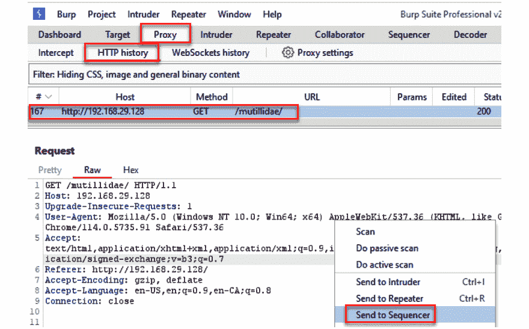

图 6.3 – 发送请求到 Sequencer

Sequencer 是 Burp Suite 中的一个工具，旨在确定会话令牌中随机性生成的强度或质量。

1.  在将**PHPSESSID**参数的值发送到**Sequencer**后，你将看到该值被加载到**选择实时捕获**请求表格中。

1.  在点击**开始实时捕获**按钮之前，滚动到**响应中的令牌位置**部分。在**Cookie**下拉列表中，选择**PHPSESSID=<捕获的会话令牌值>**：

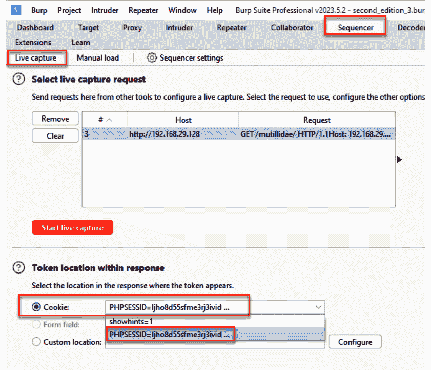

图 6.4 – 设置 Sequencer 的 cookie 值

1.  由于我们已经选择了正确的 cookie 值，我们可以开始实时捕获过程。点击**开始实时捕获**按钮，Burp Suite 将发送多个请求，从每个响应中提取**PHPSESSID**cookie。每次捕获后，**Sequencer**会对每个令牌的随机性进行统计分析。

1.  允许捕获至少收集并分析 200 个令牌，但如果你愿意，可以让它运行更长时间：


图 6.5 – Sequencer 的实时捕获

1.  一旦你收集到至少 200 个样本，点击**立即分析**按钮。每当你准备停止捕获过程时，按下**停止**按钮并点击**是**确认：


图 6.6 – 停止实时捕获

1.  分析完成后，**Sequencer**的输出将提供总体结果。在这种情况下，**PHPSESSID**会话令牌的随机性质量非常优秀。有效的熵量估计为 112 位。从网络渗透测试的角度来看，这些会话令牌非常强大，因此这里没有漏洞报告。然而，尽管没有漏洞，仍然建议对会话令牌进行此类检查：

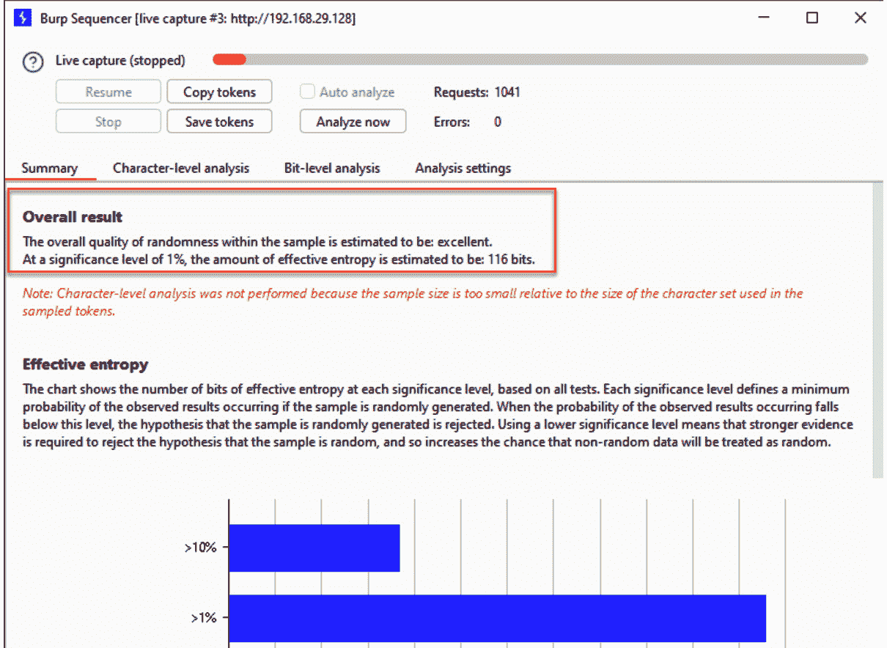

图 6.7 – 概述分析

## 它是如何工作的...

为了更好地理解 Sequencer 背后的数学原理和假设，您可以参考 PortSwigger 关于该主题的文档：[`portswigger.net/burp/documentation/desktop/tools/sequencer/tests`](https://portswigger.net/burp/documentation/desktop/tools/sequencer/tests)。

# 测试 Cookie 属性

重要的用户特定信息，如会话令牌，通常存储在客户端浏览器的 Cookies 中。由于其重要性，Cookies 需要受到保护，防止恶意攻击。这种保护通常以两种标志的形式出现——**secure** 和 **HttpOnly**。

**secure** 标志告知浏览器仅在协议加密时（例如 HTTPS 或 TLS）将 Cookie 发送到 Web 服务器。此标志可保护 Cookie 免受在未加密的通道上监听的攻击。

**HttpOnly** 标志指示浏览器不允许通过 JavaScript 访问或操作 Cookie。此标志可保护 Cookie 免受跨站脚本攻击。

## 准备工作

检查 OWASP Mutillidae II 应用程序中使用的 Cookies，确保存在保护标志。由于 Mutillidae 应用程序通过未加密的通道（例如 HTTP）运行，我们只能检查是否存在 **HttpOnly** 标志。因此，**secure** 标志不在本教程的讨论范围内。

确保 Burp Suite 和 OWASP BWA 虚拟机正在运行，并且 Burp Suite 已在用于查看 OWASP BWA 应用程序的 Firefox 浏览器中进行配置，或者使用 Burp Suite 的内置浏览器。

## 如何操作…

1.  从 **OWASP BWA** 登录页面，点击链接进入 OWASP Mutillidae II 应用程序。

1.  打开 Firefox 浏览器或 Burp Suite 浏览器，访问 OWASP Mutillidae II 的首页（URL: **http://<your_VM_assigned_IP_address>/mutillidae/**）。确保您开始的是一个全新的会话，并且未登录到 Mutillidae 应用程序：

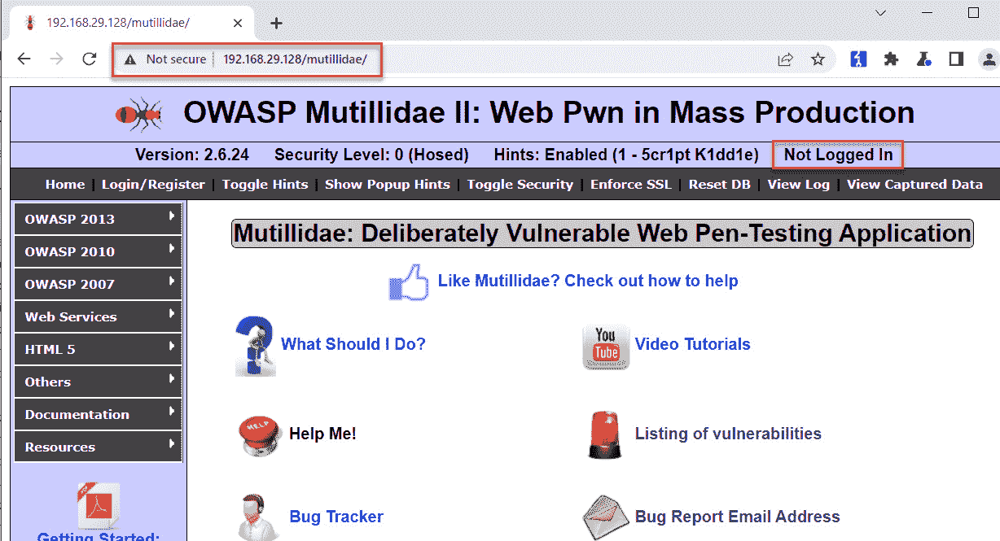

图 6.8 – 确保您未登录到应用程序

1.  切换到 **Proxy** | **HTTP history** 标签，并选择显示您首次浏览到 Mutillidae 首页的请求。查找 **GET** 请求及其关联的包含 **Set-Cookie:** 赋值的响应。每当您看到此赋值时，您可以确保为您的会话获得了新创建的 Cookie。特别地，我们关心的是 **PHPSESSID** 的 Cookie 值。

1.  在成功登录后，Cookies 应立即被设置。检查 **Set-Cookie:** 赋值行的末尾。注意两行中都没有 **HttpOnly** 标志。这意味着 **PHPSESSID** 和 **showhints** 的 Cookie 值没有受到 JavaScript 操作的保护。这是一个安全问题，您应在报告中包括该项：

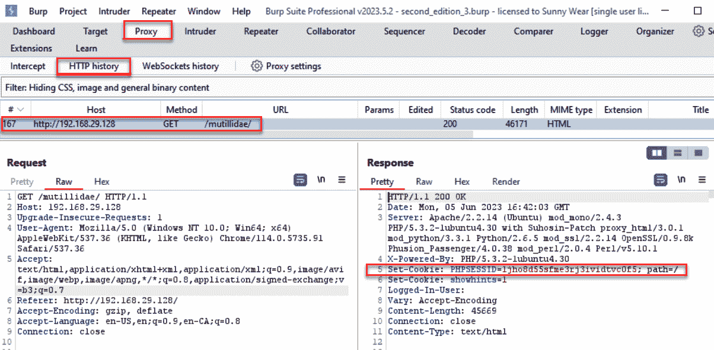

图 6.9 – 设置 PHPSESSID Cookie 的值，缺少安全标志

## 它是如何工作的…

如果两个 cookie 设置了**HttpOnly**标志，那么这些标志会出现在**Set-Cookie:**赋值行的末尾。若该标志存在，它会紧跟一个分号，结束 cookie 的路径作用域，之后是**HttpOnly**字符串。**Secure**标志的显示方式也类似：

```
Set-Cookie: PHPSESSID=<session token value>;path=/;Secure;HttpOnly;
```

# 测试会话固定漏洞

会话令牌是为用户分配的，用于跟踪目的。这意味着在以未经身份验证的用户身份浏览应用程序时，会分配一个唯一的会话 ID，通常存储在 cookie 中。应用程序开发人员应始终在用户登录网站后创建一个新的会话令牌。如果这个会话令牌没有变化，应用程序可能会受到会话固定攻击的威胁。网页渗透测试人员的责任是判断这个令牌在未经身份验证的状态和身份验证后的状态之间是否发生了变化。

会话固定漏洞存在的情况是，当应用程序开发人员没有使未经身份验证的会话令牌失效，导致用户在认证后仍能使用相同的会话令牌。这种情况允许攻击者利用窃取的会话令牌冒充用户身份。

## 准备工作

使用 OWASP Mutillidae II 应用程序、Burp Suite 中的**Proxy** | **HTTP history**标签页，以及**Comparer**，我们将检查未经身份验证的**PHPSESSID**会话令牌值。然后，我们将登录应用程序并将未经身份验证的值与身份验证后的值进行比较，以确定会话固定漏洞是否存在。

## 如何进行操作...

1.  导航到登录页面（点击顶部菜单中的**Login/Register**），但不要立即登录。

1.  切换到 Burp Suite 的**Proxy** | **HTTP history**标签页，查找在浏览到登录页面时发出的**GET**请求。记下分配给**PHPSESSID**参数的值，该值位于 cookie 中：

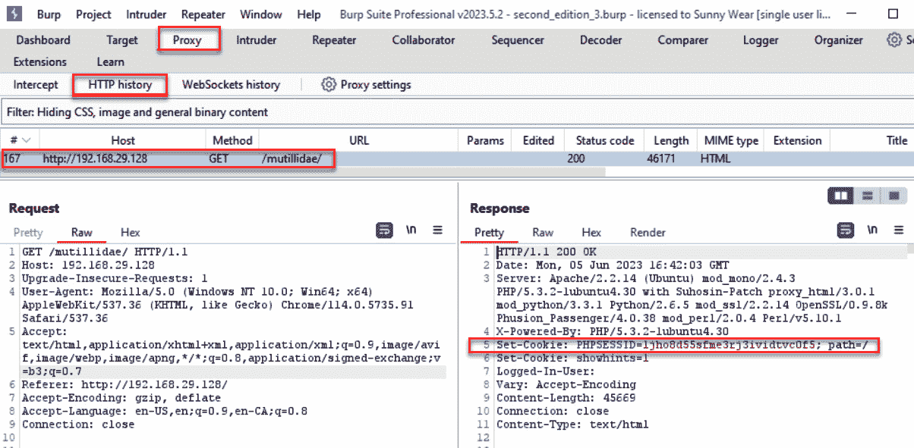

图 6.10 – 设置未经身份验证的 PHPSESSID cookie 值

1.  右键点击**PHPSESSID**参数，并将请求发送到**Comparer**：

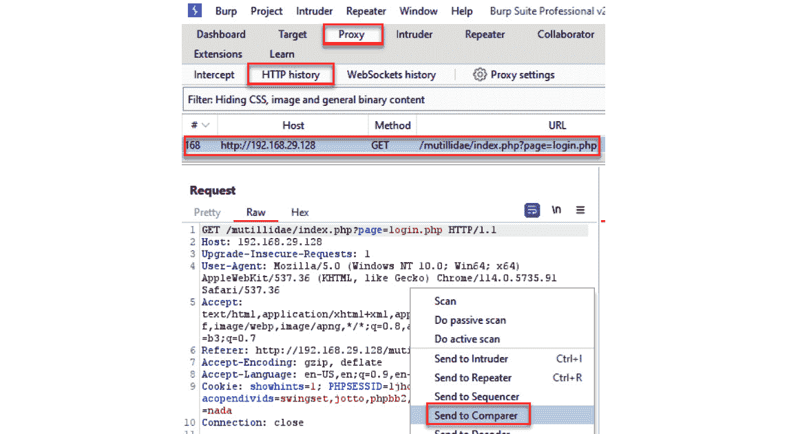

图 6.11 – 发送请求到 Comparer

1.  返回到登录页面（点击顶部菜单中的**Login/Register**），这次使用用户名**ed**和密码**pentest**进行登录。


图 6.12 – 以用户 ed 登录

1.  登录后，切换到 Burp Suite 的**Proxy** | **HTTP history**标签页。查找显示登录的**POST**请求（例如，302 HTTP 状态码），以及紧接着**POST**请求后的**GET**请求。记下登录后分配的**PHPSESSID**值。右键点击并将**GET**请求发送到**Comparer**。

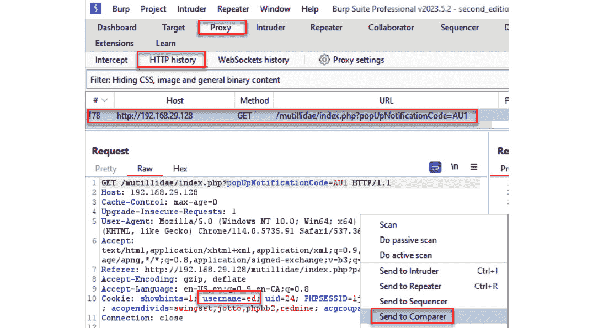

图 6.13 – 以用户 ed 登录后的 GET 请求

1.  切换到 Burp Suite 的**Comparer**。相关的请求应该已经为您高亮显示。

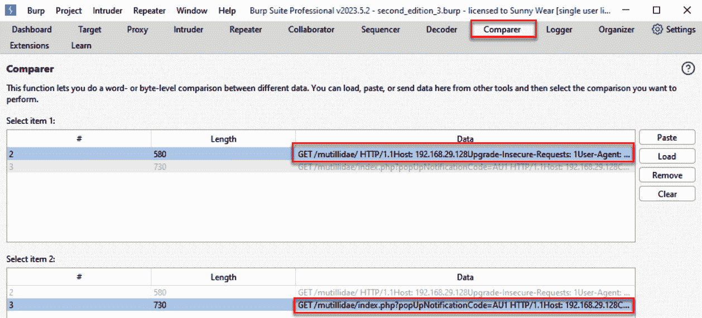

图 6.14 – 比较未认证请求与认证请求

1.  点击右下角的**Words**按钮：

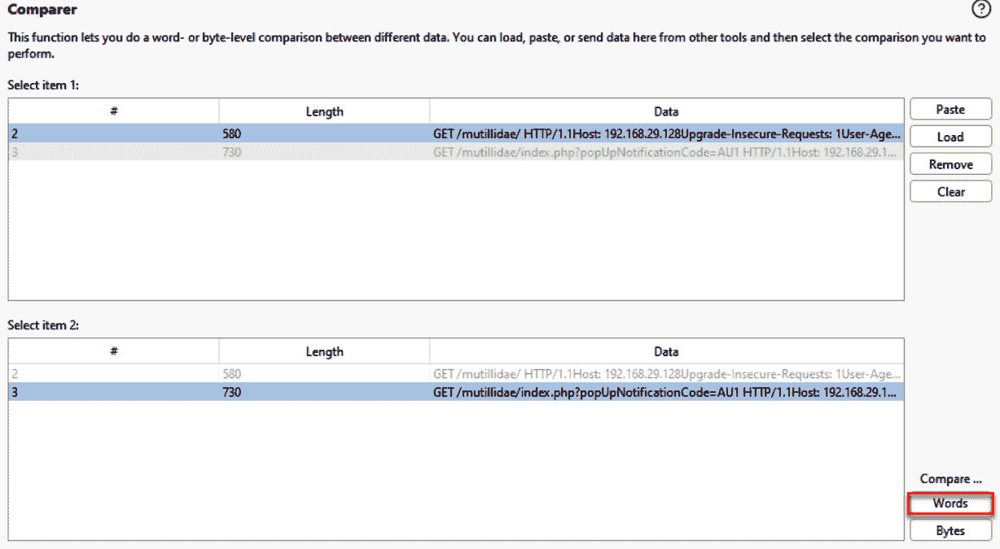

图 6.15 – 点击 Words 按钮

1.  弹出窗口会显示两次请求之间的详细比较。请注意，**PHPSESSID**的值在未认证的会话（左侧）和认证后的会话（右侧）之间并未发生变化。这意味着该应用存在会话固定漏洞：


图 6.16 – 登录后注意到 PHPSESSID 值没有变化

## 它是如何工作的...

在此实验中，我们检查了**PHPSESSID**分配给未认证用户的值，即使在认证后也保持不变。这是一个安全漏洞，允许会话固定攻击。

# 测试暴露的会话变量

会话变量，如令牌、Cookie 或隐藏的表单字段，通常由应用开发者用于在客户端和服务器之间传输数据。由于这些变量在客户端暴露，攻击者可以通过操控它们来试图访问未经授权的数据或捕获敏感信息。

Burp Suite 的**Proxy**选项提供了一项功能，用于增强所谓的*隐藏*表单字段的可见性。此功能允许 Web 应用渗透测试人员确定这些变量中数据的敏感性级别。同样，渗透测试人员可以判断是否对这些值的操作会导致应用行为的不同。

## 准备工作

使用 OWASP Mutillidae II 应用和 Burp Suite 的**取消隐藏表单字段**功能（位于**Proxy**下），我们将确定操控隐藏表单字段的值是否能获得未经授权的数据。

## 如何操作...

1.  通过点击 Burp Suite 右上角的**设置**齿轮图标，切换到 Burp Suite 的**Proxy**标签页。


图 6.17 – 全局设置按钮

1.  当大弹窗显示出来后，选择**All** | **Proxy**。

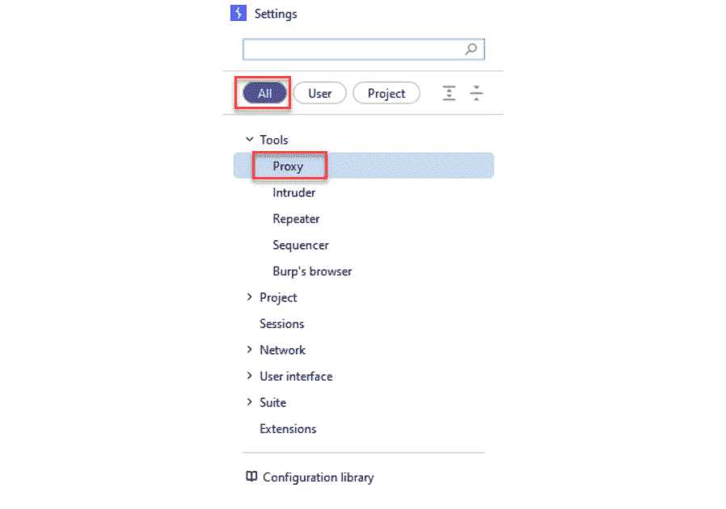

图 6.18 – 设置菜单

1.  在**Proxy**部分，向下滚动到**响应修改规则**部分，勾选**取消隐藏表单字段**和**突出显示** **未隐藏字段**的复选框：

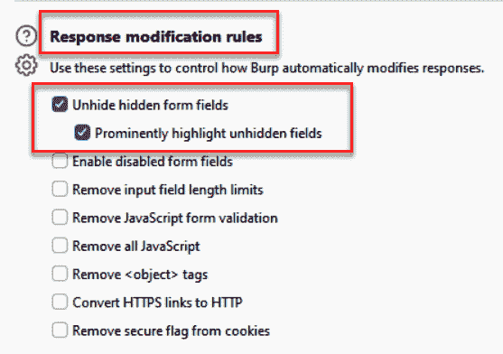

图 6.19 – Proxy | 响应修改规则子部分

1.  通过访问**OWASP 2013** | **A1 - 注入（SQL）** | **SQLi - 提取数据** | **用户信息（SQL）**页面，导航到**User Info**页面：


图 6.20 – 应用程序的用户信息页面

1.  请注意现在在页面上显眼显示的隐藏表单字段：

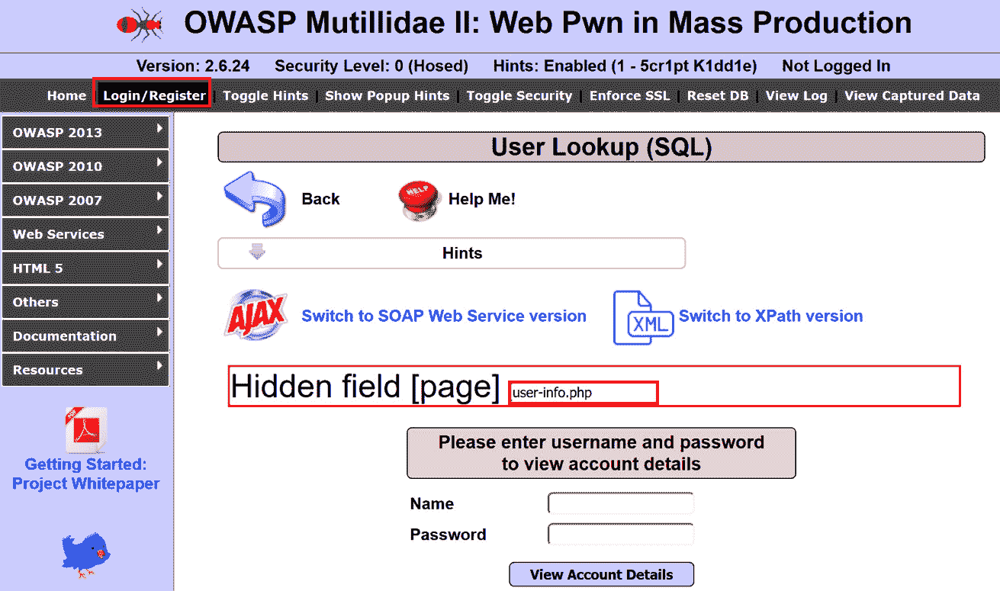

图 6.21 – 显示的隐藏字段

1.  让我们尝试通过将显示的**user-info.php**更改为**admin.php**来操作它，看看应用程序如何反应。在**Hidden field [****page]**文本框中将**user-info.php**修改为**admin.php**：

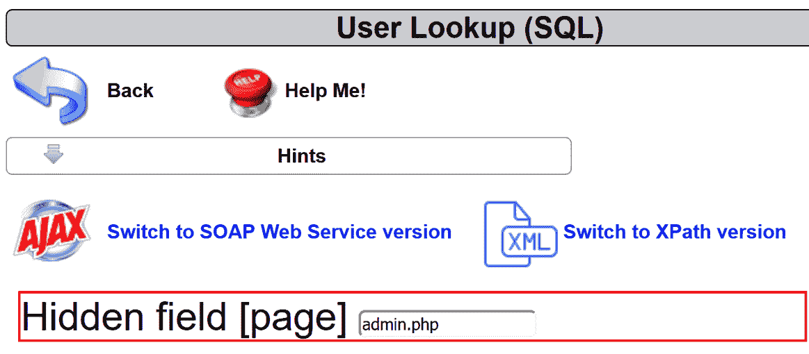

图 6.22 – 更改隐藏字段的值

1.  在进行更改后，按下*Enter*键。此时你应该会看到一个新页面加载，显示**PHP 服务器** **配置**信息：

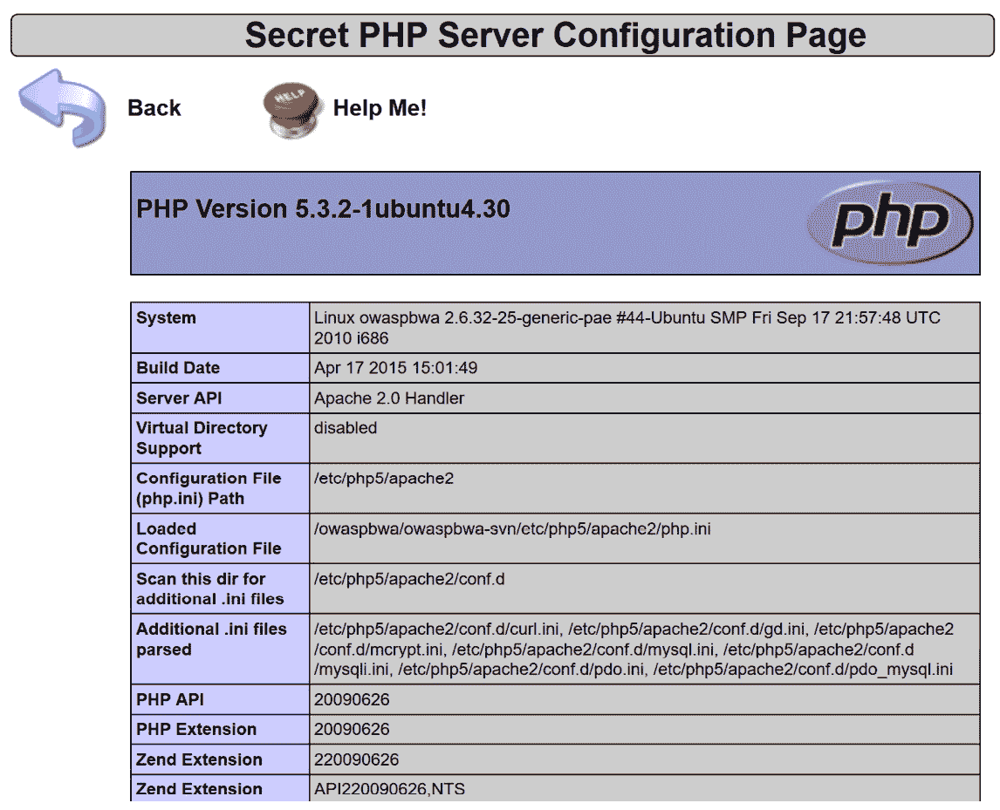

图 6.23 – 显示的 PHP 配置页面

## 如何运作...

正如在这个例子中所见，隐藏表单字段并没有什么神秘之处。作为渗透测试人员，我们应该检查并操作这些值，以确定敏感信息是否被无意中暴露，或者我们是否可以根据角色和认证状态改变应用程序的行为。在这个例子中，我们甚至没有登录到应用程序。我们操作了标有**page**的隐藏表单字段，访问了一个包含指纹信息的页面。此类信息的访问应当受到未认证用户的保护。

# 测试跨站请求伪造

**跨站请求伪造**（**CSRF**）是一种攻击，它利用已认证用户的会话，允许攻击者强迫用户代表攻击者执行不必要的操作。此攻击的初始诱饵可能是钓鱼邮件或通过受害者网站中的跨站脚本漏洞执行的恶意链接。CSRF 的利用可能导致数据泄露，甚至完全危害 Web 应用程序的安全。

## 准备就绪

使用 OWASP Mutillidae II 应用程序注册表单，确定在同一浏览器（不同标签页）中，经过身份验证的用户登录后，是否可能进行 CSRF 攻击。

## 如何执行...

要开始这个实例，首先让我们基准化账户表中当前的记录数量，并进行 SQL 注入以查看结果：

1.  通过访问**OWASP 2013** | **A1 - 注入（SQL）** | **SQLi - 提取数据** | **用户** **信息（SQL）**，导航到**用户信息**页面。

1.  在用户名提示框中，输入一个 SQL 注入载荷，来导出整个账户表的内容。载荷为**' or 1=1-- <space>**（*tick 或 1 等于 1 短横线 空格*）。然后，按下**查看账户** **详细信息**按钮。

记得在两个短横线后加上空格，因为这是一个 MySQL 数据库，否则载荷将无法正常工作：

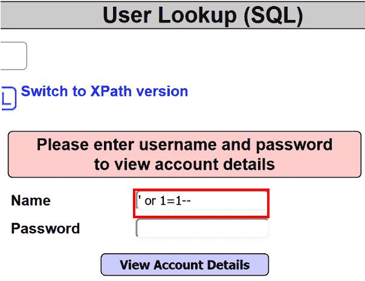

图 6.24 – SQL 注入有效载荷

1.  当操作正确时，会显示一条信息，表示数据库中找到了 24 条用户记录。消息后面的数据显示了所有 24 个账户的用户名、密码和签名字符串。这里仅展示两个账户详情作为示例：


图 6.25 – 24 条记录基线

我们确认数据库的账户表中目前有 24 条记录。

1.  现在，返回到登录界面（点击顶部菜单中的 **登录/注册**）并选择 **请在这里注册** 链接。

1.  点击 **请在这里注册** 链接后，系统会呈现一个注册表单。

1.  填写表单以创建测试者账户。输入 **tester** 作为用户名，**tester** 作为密码，**This is a tester account** 作为签名：


图 6.26 – 注册一个新用户

1.  点击 **创建账户** 按钮后，你应该能看到一个绿色横幅，确认账户已创建：


图 6.27 – 新账户创建确认

1.  返回到 **用户信息** 页面，路径为 **OWASP 2013** | **A1 - 注入（SQL）** | **SQLi - 提取数据** | **用户** **信息（SQL）**。

1.  再次执行 SQL 注入攻击，并验证你现在可以在账户表中看到 25 行数据，而不是之前的 24 行：


图 6.28 – 账户表中显示 25 行数据

1.  切换到 Burp Suite 中的 **代理** | **HTTP 历史** 选项卡，并查看为测试者创建账户的 **POST** 请求。

1.  研究这个 **POST** 请求可以看到 **POST** 动作（**register.php**）和执行该动作所需的正文数据，在本例中包括 **username**、**password**、**confirm_password** 和 **my_signature**。此外，请注意没有使用 CSRF token。CSRF token 被放置在网页表单中，以防止我们即将执行的攻击。接下来我们继续。

1.  右键点击 **POST** 请求并点击 **发送** **到 Repeater**：

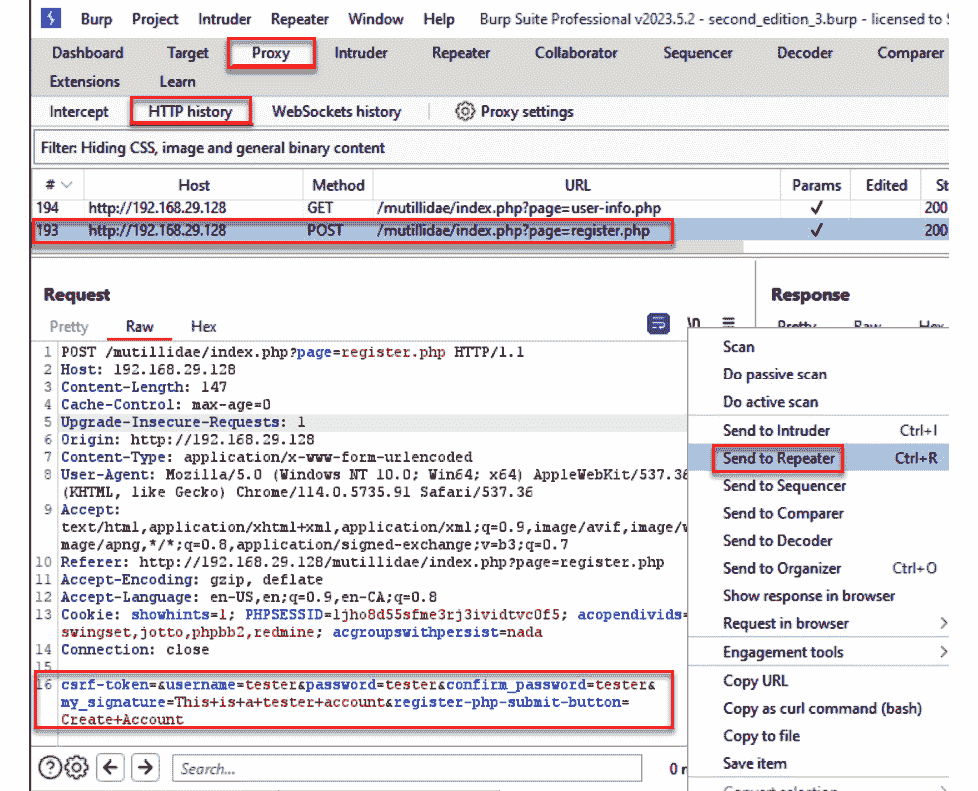

图 6.29 – 发送登录请求到 Repeater

1.  如果你使用的是 Burp Suite Professional，右键点击并选择 **参与工具** | **生成** **CSRF PoC**：

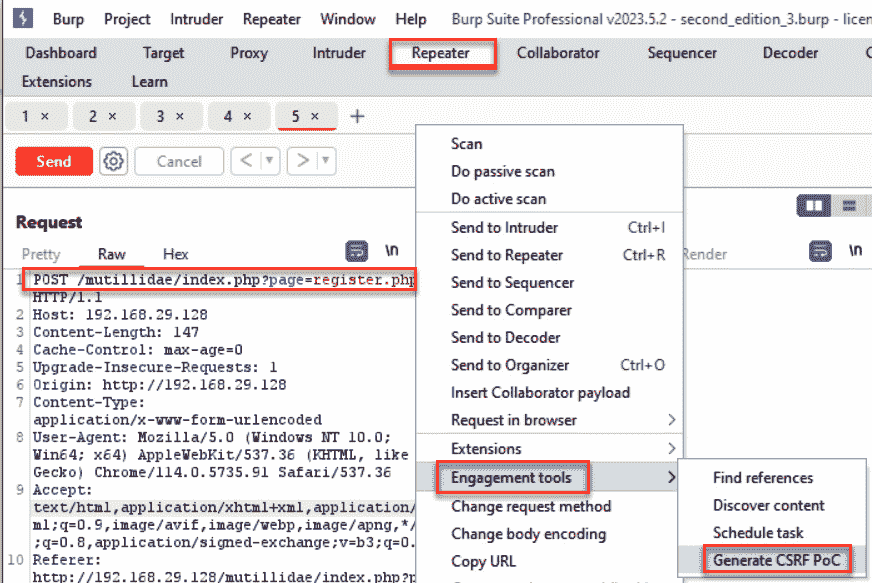

图 6.30 – 生成 CSRF PoC

1.  点击此功能后，会弹出一个框，生成与注册页面相同的表单，但没有任何 CSRF token 保护。在 CSRF HTML 文本区域内，将 **"tester"** 用户名改为 **"attacker"**，将密码改为 **"attacker"**，并将 **"tester"** 确认密码值改为 **"attacker"**：

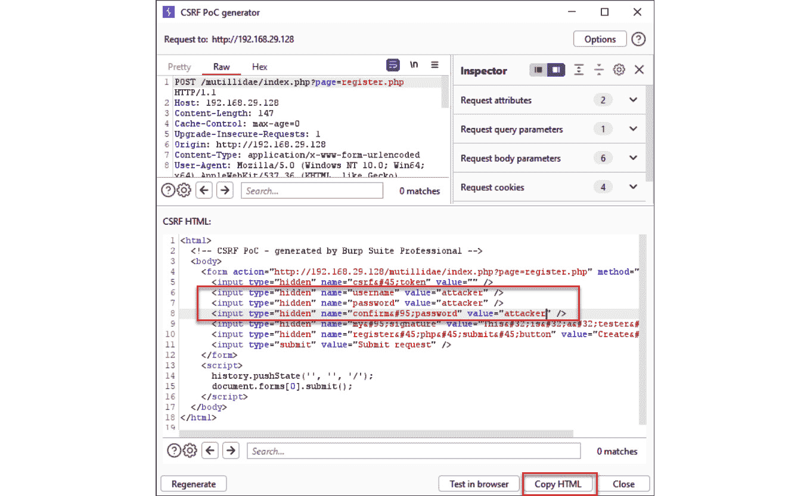

图 6.31 – 修改并复制 HTML

1.  点击 **复制 HTML** 按钮，并将其保存为名为 **csrf.html** 的文件在本地系统上：


图 6.32 – 将新文件命名为 csrf.html

1.  如果你使用的是 Burp Suite Community 版，可以通过查看注册页面的源代码轻松重建 **CSRF PoC** 表单：

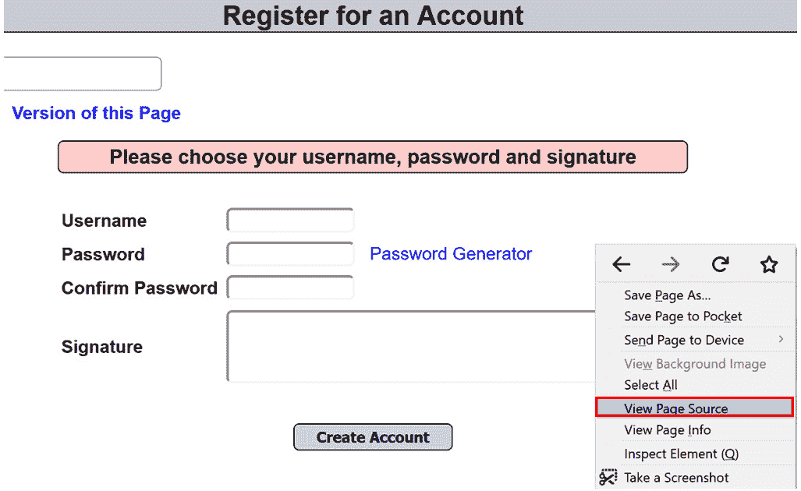

图 6.33 – 对于 Burp Suite Community 版，如何创建 CSRF PoC

1.  在查看页面源代码时，向下滚动到 **<form>** 标签部分。为了简洁起见，下面重新创建了该表单。将 **attacker** 作为用户名、密码和签名的值。复制以下 HTML 代码并将其保存为名为 **csrf.html** 的文件：

    ```
    <html>
    <body>
    <script>history.pushState('', '', '/')</script>
    <form action="http://192.168.56.101/mutillidae/index.php?page=register.php" method="POST">
    <input type="hidden" name="csrf-token" value="" />
    <input type="hidden" name="username" value="attacker" />
    <input type="hidden" name="password" value="attacker" />
    <input type="hidden" name="confirm_password" value="attacker"
    /> <input type="hidden" name="my_signature" value="attacker account" />
    <input type="hidden" name="register-php-submit-button" value="Create Account" />
    <input type="submit" value="Submit request" />
    </form>
    </body>
    </html>
    ```

1.  现在，返回到登录页面（点击顶部菜单中的 **登录/注册**）并使用用户名 **ed** 和密码 **pentest** 登录到应用程序。

1.  打开你在本地保存的 **csrf.html** 文件所在的位置。将文件拖动到 **ed** 已认证的浏览器中。在将文件拖到浏览器后，**csrf.html** 会作为一个单独的标签出现在同一浏览器中：


图 6.34 – 将新文件命名为 csrf.html

1.  为了演示，页面上有一个 **提交请求** 按钮。但是，在实际情况下，JavaScript 函数将自动执行为攻击者创建账户的操作。点击 **提交** **请求** 按钮：


图 6.35 – 在新标签页中提交请求

你应该会收到确认信息，表明攻击者账户已被创建：

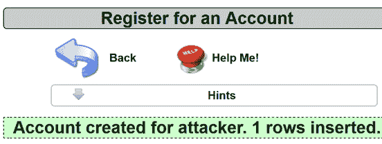

图 6.36 – CSRF 攻击成功的确认

1.  切换到 Burp Suite 中的 **代理** | **HTTP 历史** 标签，找到用于为攻击者创建账户的恶意执行的 **POST** 请求，同时利用 **ed** 的认证会话。注意 **Origin** 头部值为 **"null"**。这表明我们正在使用我们的 CSRF PoC，因为我们从本地机器（例如，*无来源*）将其拖放到认证用户会话的一个新标签页中。

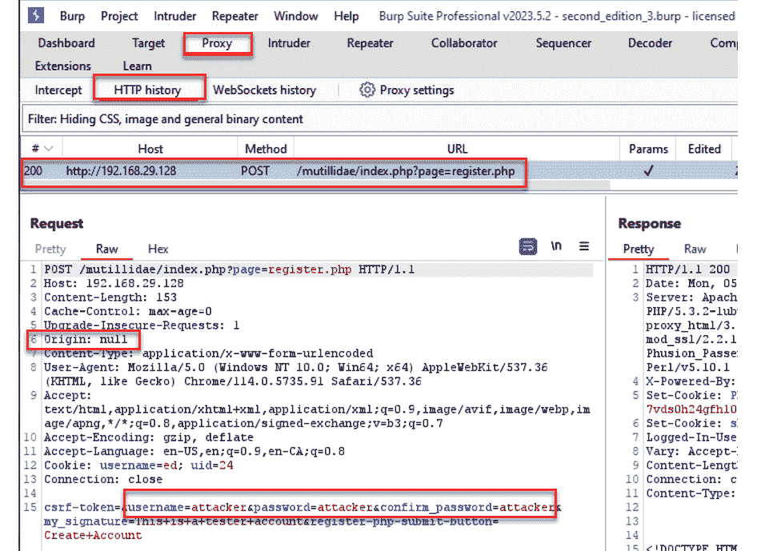

图 6.37 – Burp 中看到的 CSRF 攻击

1.  返回 **用户信息** 页面，通过访问 **OWASP 2013** | **A1 - 注入（SQL）** | **SQLi - 提取数据** | **用户信息（SQL）** 并再次执行 SQL 注入攻击。现在，你将看到账户表中有 26 行，而不是之前的 25 行：


图 6.38 – CSRF 攻击后记录计数增加 1

## 它是如何工作的...

CSRF 攻击需要一个经过身份验证的用户会话，以便在应用程序内代表攻击者偷偷执行操作。在这种情况下，攻击者利用**ed**的会话重新运行注册表单，为攻击者创建了一个账户。如果**ed**是管理员，那么这可能让攻击者获得更高权限的访问。
