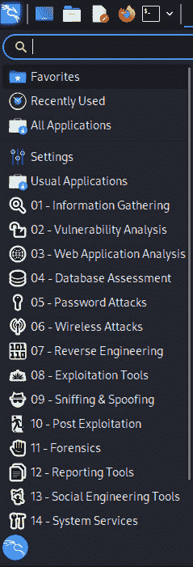
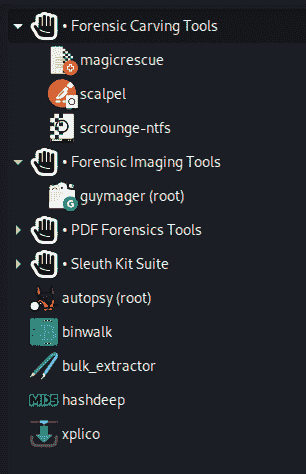

# 1

# 红队、蓝队和紫队的基本概念

欢迎阅读《*Kali Linux 数字取证*》的第三版，对于曾经购买过前几版的读者，欢迎再次回归。我还想真诚地感谢你们再次选择这本令人兴奋的书籍。与第二版一样，第三版已经更新了新的工具、易于跟随的实验室，并添加了几章新内容。我们即将开始一段激动人心的旅程，我很高兴地宣布一些重要的新增内容，包括安装 Wine，这将使我们能够在 Kali Linux 中运行 Windows 工具，并将在*第五章*《*在 Kali Linux 中安装 Wine*》中全面介绍。*第十章*《*使用 Volatility 3 进行内存取证与分析*》也是全新内容，展示了如何在较新的操作系统上执行 RAM 工件分析。另一个新章节讲述了如何使用 Autopsy v4 **图形用户界面** (**GUI**) 执行全面的 **数字取证与事件响应** (**DFIR**) 分析与调查，内容可以在*第十三章*《*使用 Autopsy 4 GUI 执行全面的 DFIR 分析*》中找到。

除了这些重要新增内容，我们还将探讨一些新话题，比如使用 Raspberry Pi 4 创建便携式 Kali Linux 盒子，了解诸如 DD-rescue、scrounge-ntfs、Magic Rescue、PDF-Parser、Timeliner、netdiscover 等工具，并介绍 **Shodan.io** 和 **apackets.com** 用于 **物联网** (**IoT**) 发现和数据包分析。

对于本书，我们采取一种非常结构化的数字取证方法，正如我们在法医科学中所做的那样。首先，我们将漫步进入数字取证的世界，了解其历史，以及一些用于取证的工具和操作系统，并立即向你介绍证据保存的相关概念。

话虽如此，我们有很多内容需要覆盖，将从学习 Kali 和各类网络安全团队开始，了解红队、蓝队和紫队之间的区别。对于我们回归的高级读者，如果你们已经具备 Kali Linux 和相关团队的基础知识，可以跳过前两章，直接进入*第三章*《*安装 Kali Linux*》、*第四章*《*附加的 Kali 安装和安装后任务*》以及*第五章*《*在 Kali Linux 中安装 Wine*》，这些章节详细讲解了 Kali 和 Wine 的安装过程。

本章将涵盖以下关键话题：

+   什么是 Kali Linux？

+   理解红队

+   理解蓝队

+   理解紫队

在我们开始讨论这些话题之前，以下是我如何进入 Kali Linux 世界的简短介绍，因为我觉得你们中的一些人可能会与我的故事产生共鸣！

# 我是如何开始接触 Kali Linux 的

数字取证已经吸引了我超过 15 年的关注。自从我得到了我的第一台 PC（感谢爸爸妈妈）以来，我一直在想，当我从那台巨大容量为 2 GB 的硬盘（**Gigabyte**）中删除文件，或将文件移动到（并且经常隐藏在）一个不太显眼的 3.5 英寸软盘中时，究竟发生了什么。那张软盘的最大容量为 1.44 MB（**Megabytes**）。

我很快发现，硬盘和软盘并不具备我曾经自信相信的数字不朽性。可悲的是，许多文件、文档和由我亲手在微软画图中创作的无价艺术作品，已经永远消失在数字的彼岸，再也无法找回。唉，世界永远无法知道这些。

直到几年后，当我在我的超快速 42 Kbps 拨号上网连接（得益于我那台昂贵的 USRobotics 拨号调制解调器）上浏览神奇的**世界宽网**（**WWW**）时，我才偶然看到了一篇关于文件恢复及相关工具的文章，每次我尝试连接到互联网时，它都会发出科技神灵的赞歌。这一过程涉及一种隐秘的忍者般技巧，即使是黑色行动小组也会为之羡慕，因为这一切都是在不让父母察觉的情况下完成的，这样他们就不会因为我占用了电话线而无法打电话（亲爱的妈妈、爸爸和年长的姐姐，抱歉了）。

前一篇关于数据恢复的文章远没有今天许多伟大的同行评审论文、期刊和书籍那样详细且内容丰富，这些资料如今在数字取证领域广泛可得。作为该领域的一个完全新手（也称为“菜鸟”），我确实学到了许多关于文件系统、数据和元数据、存储度量及各种存储介质工作原理的基础知识。正是在这个时候，尽管我读过关于 Linux 操作系统及其各种发行版（或称为“发行版”）的资料，我开始理解为什么 Linux 发行版在数据恢复和取证中如此受欢迎。

我勇敢地下载了 Auditor 和 Slax Linux 发行版，再次使用拨号上网连接。仅仅下载这些操作系统就已经是一项壮举，这让我感到非常有成就感，因为当时我完全不知道如何安装它们，更不用说如何实际使用它们了。在那个时候，简单的安装和图形用户界面（GUI）仍在不断开发中，尽管它们对用户友好（或者像我那样对我来说并不友好），这大多是由于我的经验不足、硬件不合适以及缺乏资源，如在线论坛、博客和 YouTube，这些我当时还不懂得利用。

随着时间的推移，我研究了许多在 Windows、Macintosh 和各种 Linux 发行版平台上找到的工具。我发现许多数字取证工具可以安装在不同的 Linux 发行版或版本中，而且这些工具大多数都得到了良好的维护，持续开发，并且在该领域得到了同行的广泛接受。Kali Linux 是一种 Linux 发行版或版本，但在深入了解之前，让我先解释一下 Linux 发行版或版本的概念。以你最喜欢的饮料为例：这种饮料有很多不同的口味，有些不加甜味剂或糖，颜色各异，甚至有不同的尺寸。无论如何变化，基本的原料始终是构成饮料的核心成分。类似地，我们也有 Linux，以及不同类型和版本的 Linux。一些更受欢迎的 Linux 发行版和版本包括 RedHat、CentOS、Ubuntu、Mint、KNOPPIX，当然，还有 Kali Linux。更多关于 Kali Linux 的内容将在 *第三章*，*安装* *Kali Linux* 中讨论。

话虽如此，让我们进入下一个部分，开始探索迷人的 Kali Linux 世界吧！

# 什么是 Kali Linux？

Kali Linux 是一个基于 Debian 的操作系统，被全球的网络安全专家、学生和 IT 爱好者广泛使用。Debian 是一种完全免费的 Linux 版本，稳定、持续更新，支持多种硬件，并且也被像 Ubuntu 和 Zorin 这样的流行操作系统使用。Kali Linux 在网络安全领域并不陌生，甚至可以追溯到 2000 年代中期，但当时它被称为 BackTrack，这个名字是由两个平台—Auditor Security 和 Whax 合并而成的。这一合并发生在 2006 年，随后发布的 BackTrack 版本一直持续到 2011 年，当时基于 Ubuntu 10.04 发布了 BackTrack 5 版本。

2013 年，*Offensive Security* 发布了首个 Kali v1 (Moto) 版本，该版本基于 Debian 7，随后在 2015 年发布了基于 Debian 8 的 Kali v2。之后，Kali Linux Rolling 版本于 2016 年发布，发行版的名称反映了发布的年份以及每个季度的主要更新。例如，在写这篇文章时，我使用的是 Kali **2022.3** 和 **2022.4**，这两个版本都基于 Debian 的最新版本。你可以在 [`www.debian.org/intro/about`](https://www.debian.org/intro/about) 找到更多关于开放源代码和免费的 Debian 项目的信息。

作为一名网络安全专家、**首席信息安全官**（**CISO**）、**渗透测试员**（**pentester**）以及 DFIR 领域的专家，自从 2006 年开始为认证伦理黑客考试做准备以来，我已经使用 BackTrack（现在的 Kali Linux）超过十年了。自那时以来，我使用过各种操作系统进行渗透测试和数字取证，但我最喜欢的工具，特别是对于渗透测试，仍然是 Kali Linux。尽管 Kali Linux 近年来更注重渗透测试，而非 DFIR，但它让我可以在同一个平台上同时使用渗透测试和 DFIR 工具，而不必在它们之间切换。

对于那些可能已经购买了本书第一版和第二版的读者，我想说，你们一定会觉得很有收获，因为我不仅更新了许多实验，并在这一版中引入了新工具，还包括了一个关于如何在 Kali Linux 中安装 Wine 的章节。**Windows 模拟器**（**Wine**）可以让你在 Kali Linux 中运行 Windows 应用程序。虽然需要一些配置，但我已经编写了一份逐步指南，讲解如何在*第五章*《在 Kali Linux 中安装 Wine》一章中安装 Wine。

你们中的一些人可能会好奇，为什么我们要安装 Wine，而不是直接使用 Windows 机器。其实有几个合理的原因。首先，成本是一个重要因素。如果你是学生、处于待业状态、换职业，或者生活在一个汇率和外汇限制购买许可的地区，Windows 许可证的费用就显得不那么便宜了。写这篇文章时，Windows 10 专业版的许可证费用为$199.00，微软官网上列出的价格是[`www.microsoft.com/en-us/d/windows-10-pro/df77x4d43rkt?activetab=pivot:overviewtab`](https://www.microsoft.com/en-us/d/windows-10-pro/df77x4d43rkt?activetab=pivot:overviewtab)。

尽管本书中我们不会使用商业工具，但有一些非常棒的免费 DFIR 工具可以在 Windows 上使用，例如**Belkasoft RAM Capturer**、**Autopsy 4 GUI**和**NetworkMiner**，我们现在可以在开源的 Kali Linux 环境中安装它们，而无需依赖许可的 Windows 机器。这些工具将在*第八章*《证据采集工具》、*第十三章*《使用 Autopsy 4 GUI 进行完整的 DFIR 分析》和*第十六章*《网络取证分析工具》中详细介绍。

另一个考虑因素是，Wine 再次帮我们省去了在物理机器之间切换的麻烦，并且在使用虚拟机时，还能节省一些资源，比如**随机存取内存**（**RAM**）、**中央处理单元**（**CPU**）、**硬盘驱动器**（**HDD**）空间以及其他资源，接下来我们会在下一章中更详细地讨论这一点。

最后，我们可以使用工具在 Kali Linux 中安装许多其他 Windows 应用程序，无论是生产力工具，还是用于渗透测试的工具，从而使我们的 Kali Linux 安装成为一个完美的紫队操作系统环境，我们将在本章稍后讨论。

## 为什么 Kali Linux 如此受欢迎？

除了作为最早的 InfoSec 发行版之一，Kali Linux 还有非常大的支持基础，你可以在 YouTube、TikTok 和互联网上找到数千个关于安装、使用内置工具以及安装额外工具的教程，这使得它成为一个更具用户友好的平台。

Kali Linux 还附带了超过 600 个工具，所有这些工具都被很好地分类在 Kali 的**应用程序**菜单中。Kali 中包含的许多工具可以执行各种网络安全任务，涵盖从**开源情报**（**OSINT**）、扫描、漏洞评估、利用和渗透测试、办公和生产力工具，当然还有 DFIR。工具的完整列表可以在 [`www.kali.org/tools/all-tools/`](https://www.kali.org/tools/all-tools/) 查找。

以下截图展示了 Kali Linux 菜单中类别的预览。

图 1.1 – Kali Linux 菜单中的类别列表

Kali Linux 用户还可以选择手动下载和安装（元）包，而不是下载一个非常大的安装文件。Kali Linux（元）包包含可能特定于某些评估或任务的工具和依赖项，如信息收集、漏洞评估、无线黑客和取证。或者，用户可以下载**kali-linux-everything（元）包**。我们将在*第四章*《附加 Kali 安装和后安装任务》中详细介绍（元）包的安装，但如果你想了解更多关于（元）包的内容，可以在 [`www.kali.org/docs/general-use/metapackages/`](https://www.kali.org/docs/general-use/metapackages/) 查找完整列表。

Kali Linux 之所以如此受欢迎的另一个原因是，它提供了多个版本，适用于各种物理、虚拟、移动和便携设备。Kali 可以作为独立的操作系统镜像提供，也可以通过其为虚拟平台（如 VMware 和 VirtualBox）预构建的镜像进行虚拟安装，相关内容将在*第三章*《*Kali Linux 安装*》和*第四章*《*Kali 安装及后安装任务*》中详细讨论。此外，还有适用于 ARM 设备、云实例的 Kali 版本，甚至可以在 **Windows 子系统 for Linux** (**WSL**) 中运行 Kali Linux。个人来说，我还使用了一款名为 Kali NetHunter 的移动版本 Kali Linux，它运行在一部旧的 OnePlus 手机和 Raspberry Pi 4 上，连接上移动电源后，便成为了最终的便携式安全评估工具包。至于手机安装，NetHunter（甚至在某些情况下 Kali Linux 本身）可以安装在三星、诺基亚、一加、索尼、小米、谷歌或中兴等多种手机上。我们将在*第四章*《*Kali 安装及后安装任务*》中讨论如何在 VirtualBox 和 Raspberry Pi 4 上安装 Kali Linux。

Kali Linux 提供所有这些功能免费且可以通过少数几次点击和命令轻松升级，并且可以添加新工具，这使得它成为完美的紫队解决方案。让我们来看一下红队、蓝队和紫队，以及每个团队所需的技能集。

# 理解红队

可能是 Kali Linux 用户中最为熟知的团队，红队是负责处理与 OSINT、扫描、漏洞评估和渗透测试相关的安全进攻方面的个体的集合，评估的对象包括但不限于个人、公司、终端用户（台式机、笔记本、移动设备）以及网络和关键基础设施，如服务器、路由器、交换机、防火墙、NAS、数据库、Web 应用和门户。还有一些系统，如物联网 (**IoT**)、**操作技术** (**OT**) 设备和**工业控制系统** (**ICS**) 也需要由技术精湛的红队成员进行评估。

红队成员通常被认为是高度熟练的道德黑客和渗透测试员，除了具备进行先前提到的评估所需的技能外，还可能拥有允许他们执行这些任务的技术认证。尽管认证未必直接反映个人的能力，但已知它们能帮助获得工作机会。

一些红队认证包括（但不限于）：

+   **进攻性安全认证专家** (**OSCP**)：由 Kali Linux 的开发者创建

+   **认证道德黑客** (**CEH**)：由*EC-Council*颁发

+   **实用网络渗透测试员**（**PNPT**）：由 TCM Security 开发

+   **Pentest+**：由 CompTIA 提供

+   **SANS SEC**：来自 SANS 学院的课程

+   **e-Learn 初级渗透测试员**（**eJPT**）：由*e-Learn Security*为有兴趣成为红队员的初学者开发

最终，所有这些知识使得红队员能够进行进攻性攻击（在获得明确许可的情况下）对公司进行模拟，模拟内部和外部威胁行为者，并本质上以恶意行为者可能利用和攻破个人、公司或重要资产的方式对系统和安全机制进行入侵。

Kali Linux 通常包含执行几乎所有类型的进攻性安全和红队评估所需的工具。从个人角度来看，Kali Linux 是我进行渗透测试时首选的操作系统，因为大多数用于指纹识别、侦察、开源情报（OSINT）、漏洞评估、利用和报告的工具都已经预装并随平台提供。我已经使用 Kali 进行红队演习超过 12 年了，而且我不认为这种情况会很快改变，因为他们多年来一直在维护操作系统并支持工具。

现在我们来谈谈蓝队工作。

# 理解蓝队

蓝队员通常被认为属于防守方，而不是进攻方，正如之前所写的红队员。虽然红队员专注于威胁模拟和可能的利用，但蓝队员是保护者。

红队和蓝队在许多方面是相似的，因为每个队伍的主要目标都是保护资源，并理解与数据泄露和漏洞相关的潜在影响和风险。红队可能专注于攻击技术，如网络攻击链和渗透测试，而蓝队则专注于确保不仅有防御机制来防止攻击，还要确保实施了正式的政策、程序，甚至框架，以确保有效的数字取证与事件响应（DFIR）。

蓝队员的工作内容远比红队员更多，因为蓝队员必须分析威胁，理解其风险和影响，实施安全和保护措施，理解取证和事件响应，并确保有效的监控、响应服务和措施的实施。如果蓝队员拥有红队员的知识或经验，那将非常有帮助，因为这可以更深入地理解攻击面和威胁环境。

蓝队员还必须具备广泛的技术和分析知识。虽然没有 IT 背景的人也有可能进入蓝队和 DFIR 领域，但这需要具备网络和系统管理员、以及安全分析师和威胁猎人的相关知识。例如，了解系统必须进行及时的更新和补丁修复是一种最佳实践。蓝队员不仅会理解为何需要打补丁，还会意识到在加固设备以减少攻击面时需要做更多的工作，同时还要考虑零日漏洞和人类弱点的可能性，这些可能轻易地让攻击者突破所有已实施的技术防护措施。

同时，蓝队员也常常看到招聘广告要求熟练使用**安全信息与事件管理**（**SIEM**）工具，这些工具提供实时分析、监控和警报，极大地帮助 DFIR 管理，并使得在保护数据、系统和资产时，能够更好地理解维持高安全性态势所需的保护级别。

蓝队成员必须认识到，他们的责任不仅仅局限于内部和外部资源，还会在考虑要保护的资产的威胁环境时得到扩展。威胁环境可以是设备、人员、数据，以及任何在攻击者策划攻击时可能有用的信息。这就是深入理解 OSINT 的重要性。尽管前面提到过这是一项红队技能，但对于蓝队员来说，这同样重要，因为它能够帮助他们在互联网上、社交媒体上以及暗网中搜索任何可能对自己构成威胁或在某种程度上帮助威胁行为者的信息。

一个好的例子是，蓝队员（在采取所有必要措施保护自己后）在暗网上搜索泄露的数据库，查找他们所在公司的泄露电子邮件或**虚拟私人网络**（**VPN**）凭证。蓝队员还可以使用像 Shodan.io 这样的网站，稍后我们将在本书中讨论它，用来从外部视角查找可访问的设备，如外部访问防火墙、服务器和闭路电视摄像头。以上所有场景都能帮助蓝队员制定所谓的威胁概况，尽管这些概况并不直接关注内部和外部资产，但仍会收集潜在威胁，甚至是外部发现的**妥协指标**（**IoC**）。

学习 OSINT 的一个很好的免费资源是 TCM Academy 在 YouTube 上提供的免费 4 小时课程，可以通过此链接访问：[`www.youtube.com/watch?v=qwA6MmbeGNo`](https://www.youtube.com/watch?v=qwA6MmbeGNo)。

尽管许多前面提到的技能是通过研究和无数小时的挖掘、观看 YouTube 视频和参加专业课程学习的，我列出了几项认证，它们可能有助于你在蓝队和 DFIR 领域进一步深造和发展职业生涯。

一些蓝队认证包括（但不限于）：

+   **计算机黑客取证调查员**（**CHFI**）来自 EC-Council

+   **认证云安全工程师**（**CCSE**）来自 EC-Council

+   **认证取证计算机检查员**（**CFEC**）来自 IACIS

+   **GIAC 认证取证检查员**（**GFCE**）来自 SANS

本书将详细探讨作为 DFIR 调查员和分析员所需的工具。尽管我们不会深入讨论商业工具的使用，但我会提到一些你可能在从事 DFIR 或作为蓝队员的职业生涯中需要了解的工具，尽管本书中涵盖的开源工具已经足够让你开始并开展完整的 DFIR 调查，只要遵循最佳实践和程序。

同样，DFIR 调查员和分析员必须了解遵循最佳实践和程序在证据采集、获取、分析和文档化中的重要性，因为证据和案件的完整性可能很容易被破坏。证据分析和报告结果应该是可重复的，这意味着其他 DFIR 调查员和分析员应该能够重复你所做的测试，并得到与您相同的结果。

在这方面，蓝队人员应该有一个详细且文档化的行动计划，并具备专用工具的知识。对于蓝队，有许多免费且文档化良好的最佳实践和框架，我们将在下一章中讨论其中的一些。

让我们简要回顾一下在 DFIR 调查中可能需要使用的工具，本书将涵盖所有这些工具。以下列表提供了一个具体任务的一行描述以及为完成该任务而使用的工具。可以将其视为蓝队开源工具的备忘单。你也可以复制这页，作为你进行取证和事件响应工作时的参考：

+   DFIR 的取证操作系统 – 我们定制的 Kali Linux 版本、CSI Linux 和 CAINE

+   创建一个可启动的 Kali Linux USB – Rufus 和 Etcher

+   为 Raspberry Pi 创建一个便携版本的 Kali Linux – Imager（Pi Imager）

+   在 Kali 中安装 Windows 工具 – Wine

+   内存采集 – FTK Imager 和 Belkasoft RAM Capturer

+   证据和驱动器采集 – DD、DC3DD、Guymager 和 FTK Imager

+   文件恢复和数据雕刻 – Foremost、Magic Rescue、DD-Rescue、Scalpel 和 Bulk_extractor

+   PDF 取证 – pdfparser

+   NTFS 驱动器恢复 – scrounge-ntfs

+   内存/RAM 分析 – Volatility 3

+   操作系统识别 – p0f

+   实时 Linux 取证 – Linux Explorer

+   工件发现工具 – swap_digger, mimipenguin 和 pdgmail

+   基于浏览器的取证分析工具 – Autopsy Forensic Browser

+   完整的取证分析工具 – Autopsy 4

+   网络发现工具 – netdiscover 和 nmap

+   IoT 搜索引擎 – [Shodan.io](http://Shodan.io%20)

+   基于浏览器的网络数据包捕获分析 – Xplico

+   自动化的网络数据包捕获分析 – Network Miner 和 PcapXray

+   在线 Pcap 分析工具 – [packettotal.com](http://packettotal.com), [apackets.com](http://apackets.com%20)

接下来，让我们来看看紫队合作。

# 了解紫队合作

现在，让我们进入紫队合作的“禅宗时刻”。**紫队合作**这个术语指的是红蓝队技能的结合。紫色也可以通过混合红色和蓝色获得，因此得名紫队合作。回顾在红蓝队部分提到的所有技能和认证，可能会觉得这是一个不可能完成的任务；然而，我可以向你保证，有许多紫队成员曾经是新手，最终成了专业人士，我也是其中之一。

当我在 2000 年代初期开始我的网络安全之旅时，我对道德黑客和渗透测试（红队）更感兴趣，那时我常常整夜坐在桌前阅读、研究，并使用当时极为有限的工具。直到大约 2008 年，我才决定涉足数字取证与事件响应（DFIR），并对取证领域产生了浓厚兴趣，以至于我开始教授 CHFI 课程并与 CEH 课程并行授课。

每次我想要专注于某一领域时，总会遇到一个新工具，促使我关注另一个领域。幸运的是，这一切最终对我有利，因为我很快意识到红蓝队之间有很多重叠的部分，而且也没有哪个时刻我可以说自己已经学够了。我的意思是，网络安全是一个动态变化的领域，拥有多种路径，你永远无法学得足够。总有新的漏洞、新的调查工具或新的事件响应程序等待你去学习，而你需要决定是专注于某个领域，还是像我一样继续学习和成长，并在需要时应用你的知识。

快进到今天，我是计算机取证与安全研究所的所有者，在这里我不仅领导一个紫队，还担任首席渗透测试员以及首席取证和事件响应调查员。同样，一旦你全身心投入，是完全有可能在这两个领域都成为专家的。

在这方面，我可以自信地说，Kali Linux 是开始的完美平台，因为它提供了最适合紫队合作的工具。让我们快速浏览一些可供使用的渗透工具（红队工具），这些工具都在任何版本的 Kali 中预安装。

这只是 Kali 中**Exploitation**菜单中的工具的一部分；然而，我在红队评估中通常会专注使用**metasploit 框架**、**msf payload creator**和**社会工程工具包（root 权限）**。

图 1.2 – Exploitation 菜单中的工具

现在让我们看看 Kali Linux 中的**取证**菜单：

图 1.3 – 反取证菜单中的工具

再次强调，这只是一些取证工具，其他工具也可以通过查看**所有应用程序**菜单找到，我们将在*第三章*，*安装 Kali Linux*中探索。Kali Linux 是为紫队提供多种工具的少数用户友好平台之一，我期待在接下来的章节中向您展示如何有效使用其中的许多工具。

在*第三章*，*安装 Kali Linux*，我将逐步向您展示如何在安全的虚拟测试环境中设置 Kali Linux，我们可以在其中使用工具并下载样本文件进行分析。虽然此虚拟机将连接到互联网，但我们将在沙盒环境中使用它，以确保不影响您的生产环境。在*第五章*，*在 Kali Linux 中安装 Wine*，我还将带您完成在 Kali Linux 中安装 Wine 的过程，以帮助构建您的终极蓝队和紫队工具库，现在结合了最好的开源 Windows 和 Linux 工具。

现在我们已经了解了红队、蓝队和紫队的区别，我们将继续理解数字取证，并查看其他取证平台和一些商业工具，尤其重要的是，在*第二章*，*数字取证简介*中，我们将深入了解取证框架。

# 总结

在本章中，我们介绍了 Kali Linux 的基于 Debian 的操作系统及其在网络安全领域的实用性。我们还了解了网络安全中的不同团队，如红队（由关注攻击性安全和道德黑客的个人组成，如渗透测试员）和蓝队（由关注网络和数据防御的个人组成，如取证调查员）。我们还了解到，具备红队和蓝队技能和经验的个人被视为高技能紫队成员，这表明该个人精通广泛的漏洞评估、渗透测试、以及事件响应和数字取证工具，其中许多工具可以在 Kali Linux 中找到。

接下来，我们将更深入地探讨数字取证，了解其他取证操作系统，并学习取证框架以及常用的开源和商业工具。下一章见！
