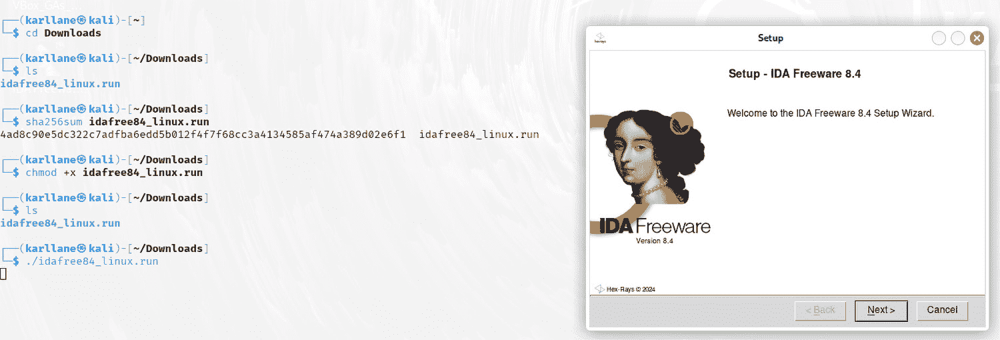
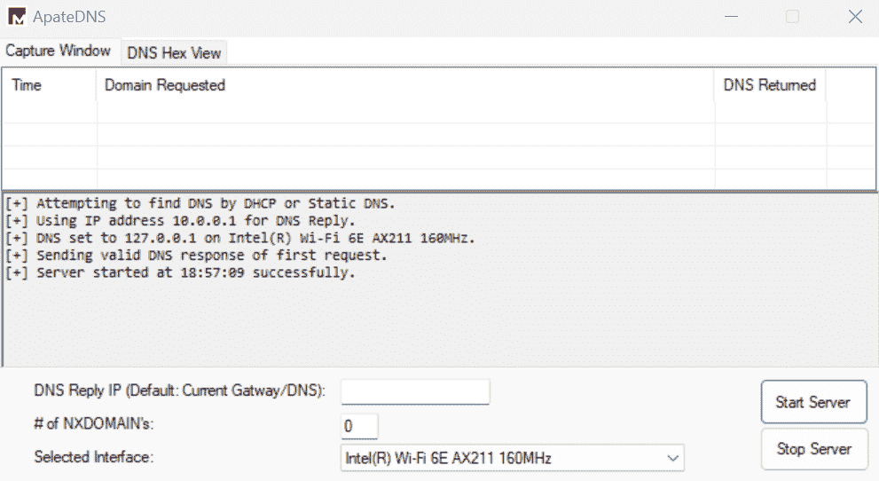
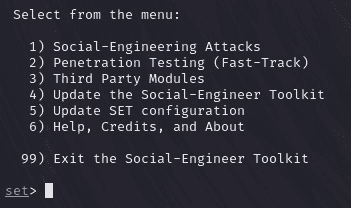
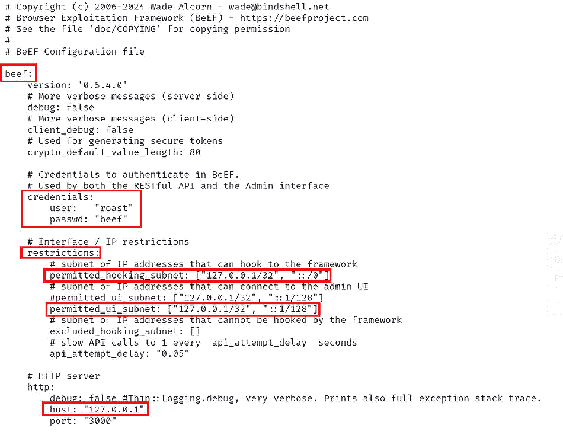

# 9

# 数字取证

到目前为止我们讨论的工具旨在分析、识别、捕获和存储数字流量，以帮助网络安全防御团队进一步分析和响应。部分工具本身在设计上就具备自动响应的潜力，可以代表我们这些愚蠢天真的人做出反应。

然而，无论我们的网络防御技术多么先进，无论我们训练得多么充分，总会有人具备与我们相当或更高的技能，能够找到更加复杂和高级的方法来绕过我们的防御。这些人往往是世界上一些更具破坏性的网络犯罪分子；他们可能受过大预算组织的培训，比如国家级组织或有组织的犯罪团伙。他们擅长打持久战，花费时间和金钱——必要时长达数年——来培养那些高度专注的人员，这些人员可能认同雇主的使命和信仰体系；这完全在他们的耐心范围内。

具备如此高级技能和训练的人无疑会随着时间的推移，将一些他们的手段传授给训练较少、经验不足的人，集体而言，这就导致了网络对手的顶级层次。有时候，这些人所犯的罪行根本不属于数字性质，但他们会使用数字技术作为支持或记录其活动的工具。当这些人被捕时，依据抓捕他们的法律管辖区，他们可能有权享受正当程序，并且在未被证明有罪之前享有无罪推定权。获取任何与技术相关的违法证据，都依赖于数字取证调查员。

事实证明，Kali Purple 提供或支持与数字取证和深度分析相关的多个工具。在本章中，我们将介绍一些在这一领域中较为突出的工具，并且讲解如何将它们添加到或激活它们在 Kali Purple 安装中的功能。

此外，我们还将介绍一些这些不法分子最初用来开展业务的工具。为什么这么做？因为通过了解这些工具——它们也是 Kali Purple 的一部分——以及它们的使用方式，能够帮助我们理解不法分子试图做什么。不仅如此，我们还可以利用这些工具来训练组织中的成员，然后开展模拟活动，检验他们的学习成果，从而评估我们所提供培训的质量和效果。本章将涵盖以下主题：

+   数字取证和恶意软件分析

+   **社会工程学工具包** (**SET**)

+   **浏览器利用框架** (**BeEF**)

+   Maltego

# 技术要求

本章中的应用程序比前几章的资源占用要小得多。然而，如果你正在完成完整的 Kali Purple 体验，我们建议你记住其他章节中的更严格要求，特别是当你在使用这些工具时，可能需要使用某些工具的组合。

+   **最低要求**：一台计算设备，架构为 amd64（x86_64/64 位）或 i386（x86/32 位）。设备至少应配备 4GB 内存。

+   **推荐要求**：根据网络安全领域从业人员的反馈，建议使用 amd64（x86_64/64 位）架构，配备 8GB 内存。

# 数字取证与恶意软件分析

**数字取证**是一个独立的职业领域。随着技术的快速发展，犯罪行为中的技术应用也在不断演变。大型执法机构雇佣专门分析人员，从数字设备中提取有价值的数据。Kali Purple 兼容一些用于支持这一职业领域的工具。你也可以将这些工具与已经学习的其他工具一起使用。请记住，并非所有的恶意行为都会从执法专业人员的角度被察觉。

目前从事网络安全工作的你们已经非常熟悉这一点了。作为分析师，你们将成为第一时间接触到恶意甚至是明显犯罪行为的人员之一。在职业生涯中，你可能会遇到这样的情境，虽然没人愿意在这种情况下被发现，但如果真是如此呢？想象一下，在你日常的网络安全工作中，如果你发现了一些有罪的证据，最终能够在坏人对他人造成伤害之前把他们从街头抓获，事情会怎样？只是因为我们坐在塑料和硅基面包板设备后面，并不意味着我们的职业不重要，绝对也不意味着我们无法挽救生命，保护无辜的人免受他人恶意的侵害。

在本节中，我们将探索一些用于进行数字取证提取和分析的工具。让我们从一个用于分析 Windows 应用程序的工具开始。

## 可移植可执行文件标识符（PEiD）

PEiD——也叫**PEv**（**PE 版本**）——是一个流行且广泛使用的工具，用于识别和分析 Windows 可执行文件（PE 文件）。它专门用于检测可执行文件中使用的打包器、加密器和编译器。PEv 通常用于恶意软件分析和逆向工程领域，以了解可执行文件的性质，并识别潜在的恶意特征。当使用 PEv 分析文件时，它提供了关于创建可执行文件的特定打包器或编译器的见解，有助于理解文件的行为和潜在的安全风险。PEv 帮助安全专业人员和分析师根据文件的内部特征识别和分类可执行文件，帮助检测和分析潜在的有害软件。

要安装 PEv，请执行以下步骤：

1.  输入**sudo apt update**和**sudo apt upgrade**。

1.  然后，输入**sudo apt** **install pev**。

一些较旧的系统和版本可能需要你通过输入**sudo bash pev**或**sudo ./pev &**来启动 PEiD，但更可能的情况是，你需要导航到 PEiD 安装的目录——应该是**/usr/bin**——并输入**sudo pescan -v <filepath/filename>**，请注意，文件必须是 Windows 可执行文件，这样该应用程序才能正常工作，因为这个应用程序就是为此设计的。

或者，你可以选择 Kali Purple 桌面左上角的 Kali 龙形象图标，位于**文件**下方，在搜索栏中输入**pev**，然后从下拉菜单中选择**pev**选项：

图 9.1 – 使用 Kali 搜索功能查找应用程序

让我们检查下一个产品。

## PEScan

另一个与 PEiD 配合使用非常好的数字取证工具是**PEScan**，你应该已经在系统上安装了它。与专门用于分析 PE 文件的 PEv 不同，PEScan 是一个完全独立的工具，旨在检测文件类型，特别注重识别 PE 文件类型的特征。它通过分析文件结构来判断文件是否符合已知的 PE 文件规格。PEScan 还可以用来识别头部、节、导入和其他属性的特征。

在恶意软件分析方面，PEScan 在识别和分析 Windows 可执行文件中的潜在威胁时非常有价值。它通常与其他安全工具和分析技术一起使用，以深入了解可执行文件的功能和行为，帮助识别恶意代码。

PEScan 在识别和确认系统中 PE 文件的存在或分析可疑文件以确定其性质和潜在影响方面最为有用。这个工具提供了宝贵的信息，有助于评估文件的威胁级别，并协助制定适当的缓解策略。

要使用 PEScan，在你的 Kali Purple 桌面上打开命令终端，首先输入**pescan**来查看额外选项的列表。在那里，你将看到如何使用这个工具的示例，且非常直观。如果你想使用展示的任何选项，你只需在**pescan**和**<filename>**之间输入你看到的第一个值。例如，如果你想显示**putty.exe**的版本，可以输入**pescan -V putty.exe**，特别注意选项是区分大小写的：

图 9.2 – PEScan 在命令终端中的使用

让我们看看下一个工具。

## IDA Pro

**IDA Pro**是一个高级交互式反汇编器，被广泛认为是逆向工程、恶意软件分析和二进制分析中最强大和全面的工具之一。其强大的功能集、可扩展性以及跨平台支持使其成为从事恶意软件分析、漏洞研究、二进制分析的专业人士的首选工具，尤其是在逆向工程是其职业的一部分时。

**逆向工程**是分析系统、产品或软件应用程序的过程，以理解其设计、架构、功能和行为。通常，这个过程的目标是复制或修改其特性，实现互操作性，或识别潜在的安全漏洞。就软件而言，逆向工程通常涉及可执行二进制文件、固件或硬件，以揭示其底层逻辑和功能——即揭示软件是如何构建以*思考*的。

IDA Pro 有许多关键功能，包括以下内容：

+   **反汇编和反编译**：IDA Pro 能够反汇编和反编译各种可执行文件和二进制文件，提供代码及其行为的人类可读表示。它支持多种处理器架构，使其在分析不同类型的可执行文件时具有广泛的适用性。

+   **图形用户界面（GUI）**：IDA Pro 的 GUI 允许交互式地探索反汇编代码、控制流图和数据结构，使得逆向工程师和安全分析师可以直观且易于使用。**数据结构**是一种组织和存储程序内部数据的方式，不同于数据库，它使得计算机可以高效地访问和操作数据。一些例子包括列表、队列、树、图和哈希表。

+   **跨平台支持**：IDA Pro 支持不同操作系统和处理器架构下的二进制文件反汇编与分析，允许分析人员处理各种可执行格式和平台。

+   **插件生态系统**：IDA Pro 拥有强大的插件架构，使用户能够通过自定义脚本和插件扩展其功能。这种扩展性允许创建专门的分析和可视化工具，从而增强 IDA Pro 的能力。

+   **静态分析和数据流分析**：IDA Pro 提供静态分析功能，包括跟踪反汇编代码中的数据流、识别函数调用和重构高级结构，如循环和条件。在此情况下，**循环**指的是软件反复执行某段代码，通常每次循环都会迭代某个变量。例如，可能会对数值进行加减操作。**条件**则指的是当满足特定条件时才执行某段代码，通常在原始代码中可以看到**if**、**else**、**if else** 或 **elseif** 等语句。

+   **二进制打补丁和修改**：IDA Pro 使用户能够对二进制文件进行打补丁并修改其行为，提供了一个用于漏洞研究、攻击开发和特定用例的二进制修改平台。

+   **协同分析**：IDA Pro 支持协同分析，允许多个分析人员在同一反汇编数据库上工作，并分享他们的发现、注释和评论。

+   **脚本编写与自动化**：IDA Pro 包含一个内置的脚本语言，允许用户自动化重复任务、创建自定义分析流程，并通过脚本扩展工具功能。该语言被称为**IDAPython**，从字面上看与 Python 相同。之所以单独命名，是因为它包含了专门的 API 和语言库选项，这些工具特别针对逆向工程。

+   **调试器集成**：IDA Pro 集成了各种调试器，支持静态分析和动态调试之间的无缝切换，便于将反汇编代码与动态运行时行为关联起来。这些调试器包括**GNU 调试器**（**GDB**）、**Windows 调试器**（**WinDbg**）、OllyDbg、x64dbg、**LLVM 调试器**（**LLDB**）、QEMU 调试器和 Radare2 调试器，同时也提供了高级用户集成自定义调试器的选项。

+   **处理器模块软件开发工具包（SDK）**：IDA Pro 提供了一个处理器模块 SDK，允许为分析和反汇编针对特定架构的可执行文件创建自定义处理器模块。这是 Hex-Rays（IDA Pro 的创建者）为 IDA Pro 提供的工具，旨在帮助开发人员扩展反汇编能力。

+   **文件格式支持**：IDA Pro 支持多种文件格式，包括 ELF、PE、Mach-O 和 COFF 等，这使得它成为分析来自不同操作系统和平台的可执行文件的多功能工具。

+   **广泛的社区文档**：IDA Pro 受益于一个非常活跃的用户社区、广泛的文档和在线资源，使其成为逆向工程和安全研究社区中一个得到广泛支持和采用的工具。如果你想了解更多关于此产品及其在线社区的内容，请点击前面的链接，我们也会在*进一步阅读*部分为你提供 Hex-Rays 的链接，供你将来参考。

要获取 IDA Pro 的副本，登录到你的 Kali Purple 环境，在该环境中打开一个网页浏览器，访问[`hex-rays.com/ida-pro/`](https://hex-rays.com/ida-pro/)。不要被要求购买许可证的提示吓到。他们有一个免费版本供你在决定是否花钱之前尝试。要找到免费版本，只需向下滚动页面，直到看到**Which version of IDA is the best for you?**部分。在那里，你会看到一个演示版本或一个简单的免费版本。选择你喜欢的选项，然后你会被带到一个页面，获取你的 SHA256 哈希值。到现在，你知道该怎么做了。记录你的哈希值并下载 Linux 版本（假设你在 Kali Purple 环境中）：

图 9.3 – IDA Pro 官网下载页面

文件下载完成后，你需要打开一个命令行终端窗口，如果你还没有更新和升级系统，可以先通过**sudo apt**进行更新和升级。从这里开始执行以下步骤（将**<文件名>**替换为你的实际文件名—我们的文件名是**idafree84_linux.run**）：

1.  输入**cd Downloads**进入你的**Downloads**文件夹。

1.  输入**ls**并按*Enter*确认 IDA Pro 已成功下载。

1.  输入**sha256sum <文件名>**来确认该哈希值，如果你有更新版本，记得修改文件名。

1.  将屏幕上显示的哈希值与下载页面上记录的哈希值进行比较—示例如*图 9.3*所示。

1.  为了让 Kali 能够成功运行文件，请输入**chmod +****x <文件名>**，为文件设置适当的权限。

1.  要解压文件并正式安装 IDA Pro，请输入**./<文件名>**。

1.  你会看到一个小的 GUI 弹出窗口，如*图 9.4*所示。按照这些提示，接受默认值：

图 9.4 – IDA Pro 下载解压

要运行 IDA Pro，请执行以下步骤：

1.  进入 Kali 提取文件的目录（我们的目录是**~/idafree-8.4**）。

1.  输入**./ida64**。

1.  如果收到错误，请尝试输入**chmod +****x ida64**。

1.  重新输入**./ida64**。

1.  如果你同意 EULA，阅读并接受许可协议。

1.  阅读**用户界面遥测**弹窗并决定是否分享数据（完全由你决定）。

1.  按照指示操作，IDA Pro 应该能正常启动。

能够解构和逆向工程任何一件现代技术本身就是一项值得炫耀的壮举。不过要小心！无论你的意图多么无害，世界上许多事情都基于感知，这可能并不公平，但人们确实会因间接证据而陷入法律麻烦。所以，当你 – 理解地 – 向朋友或对技术不太了解的家人炫耀你的拆解和逆向工程技能时，要明确自己在学习探索，并且完全尊重创作者的知识产权。此外，在拆解任何产品之前，一定要仔细查看其许可协议，因为许多许可协议严格禁止此类行为，哪怕你的意图是无害和纯粹的，也可能因此陷入法律困境。

## Volatility3

根据波动性基金会官网，**Volatility 框架**于 2007 年首次在 Black Hat DC 公开发布。**Volatility**是一个开源的内存取证框架，用于分析数字系统中的易失性内存，例如 RAM。易失性内存是系统在运行时用来存储和处理变量及其他必要信息的内存。系统关闭后，这部分内存会被清空；永远消失。Volatility 使得事件响应人员、取证分析师和安全研究人员能够从内存转储中提取有价值的信息，以调查安全事件、恶意软件感染和系统妥协。

正如你可能猜到的，Volatility 有一些关键特性，使其成为数字取证领域的一个重要工具。它提供了对易失性内存内容的有价值洞察，帮助识别、分析和响应安全事件，无论是传统的安全事件还是网络安全事件。

其中的一些功能包括以下几点：

+   **跨平台支持**：在这里，“平台”指的是操作系统的品牌/类型 – 通常称为平台。Volatility 支持所有主流操作系统，如 Windows、Linux、MacOS 和 Android。这使得它成为取证分析师的一个有吸引力的选择，尤其是那些需要在多样化环境中进行内存分析和其他取证调查的分析师。

+   **内存取证**：这是 Volatility 的主要焦点，也是该产品的核心功能。Volatility 特别为内存取证而构建，提供了工具和插件来提取和分析易失性信息——即在被分析系统关闭时可能迅速丧失的信息——来自内存转储。进行此类分析可以产生有助于识别运行进程、网络连接、注册表项等的结果。

+   **插件架构**：Volatility 采用模块化设计，并通过其插件架构实现可扩展性。**模块化**意味着产品本身的代码被分成独立功能的块，称为**模块**。这使得产品编程代码的某些部分可以在不影响其他代码的情况下更新和测试。模块化架构意味着用户可以更容易地为 Volatility 开发自定义插件，或利用现有插件更高效地从内存转储中提取特定信息，并且对整体产品代码的风险较小。

+   **进程和恶意软件分析**：Volatility 使得分析正在运行的进程成为可能，能够识别恶意进程、命令历史、加载的模块以及注入的代码。正在运行的进程很可能正在积极使用易失性内存，即 RAM，因为程序需要通过这种方式保持运行。RAM 存储了进程在执行其编程任务时需要访问的关键值。此功能有助于恶意软件分析和理解系统行为。

+   **网络分析**：该框架允许分析师从内存转储中提取与网络相关的信息，如开放端口、已建立连接、网络配置和通信活动。内存转储，有时也称为核心转储或崩溃转储，是在特定时间点快速复制系统的易失性内存。当系统崩溃或出现错误时，它会迅速尝试抓取易失性内存的副本。系统通常只有极短的时间来执行此操作，并且没有保证它会成功。因此，这些副本通常被称为**快照**。

+   **注册表分析**：Volatility 支持对内存转储中的注册表项进行分析，帮助分析师检索系统配置、用户配置文件、已安装软件以及与用户活动相关的遗留信息。注册表项是 Windows 操作系统架构中的核心组件。Windows 注册表是一个集中式数据库，存储与操作系统本身、硬件、软件及单个用户设置相关的配置设置、选项和信息。它在系统初始化、应用程序设置、设备配置、用户偏好和设备的系统安全性中确实起着至关重要的作用。

+   **文件系统分析**：Volatility 提供了工具来提取有关文件、目录和文件系统结构的信息，如 FAT、FAT16、FAT32、NTFX 和 EXT APFS，以及内存转储中的文件句柄。拥有软件工程经验的朋友会将文件句柄识别为程序员所称的文件描述符。**文件描述符** 是分配给打开文件或应用程序内 **输入/输出** (**I/O**) 资源的唯一数字值。它有助于系统跟踪并同时管理多个文件访问，而拥有这些信息对于数字取证调查员来说非常有价值。它将帮助他们理解文件访问模式并识别基于文件的取证痕迹。

+   **时间线分析**：该框架提供时间线分析功能，通过关联带时间戳的内存痕迹来重建系统上的事件顺序。这不仅仅是知道某个操作或活动发生的时间。调查人员和分析师可以重建事件，了解某些事情发生的顺序，而了解顺序本身可以帮助判断活动是否具有恶意性质。即使已经确定活动是恶意的，它也可以帮助识别该活动的目的或根本原因。换句话说，Volatility 有助于事件重建和时间线再现。

+   **社区支持和更新**：与 Kali Purple 发行版中的大多数资源一样，Volatility 拥有一个活跃的用户和开发者社区，他们为框架贡献新插件、提供支持并持续更新，以应对不断变化的取证挑战并支持新的操作系统版本。今天，Volatility 主要由一个名为 Volatility Foundation 的 501(c) 非营利组织管理。该基金会提供收费的在线培训课程。

+   **与其他工具的集成**：Volatility 无缝地与 IDA Pro 以及其他取证工具如 Wireshark 和我们之前提到的调试器类工具集成。与所有安全集成一样，这有助于增强产品的整体功能，在这种情况下，提升内存取证调查的能力，并支持与现有工作流的互操作性。

要获取 Volatility 的副本，打开 Kali Purple 命令行终端窗口，并根据需要进行更新和升级。当准备好时，执行以下操作：

1.  输入 **sudo git** **clone** [`github.com/volatilityfoundation/volatility3.git`](https://github.com/volatilityfoundation/volatility3.git)。

1.  输入 **cd volatility3** 以进入安装目录。

1.  输入 **pip3 install -****r requirements.txt**。

1.  输入 **python3 vol.py -h** 以验证安装是否成功。

1.  输入 **sudo mkdir memory_dumps** 以创建一个用于存储内存转储文件的目录。

1.  输入 **cd memory_dumps** 以进入该目录。

1.  通过输入**sudo touch firstdump.raw**创建一个内存转储文件供 Volatility3 报告。（只要记住文件名以便执行 Volatility3，你可以随意命名。）

1.  让我们确保所有的用户和文件权限都已设置 – 输入**pwd**获取你的**memory_dump**目录的完整文件路径，记录该路径，然后输入**cd**返回到根目录。

1.  输入**sudo chmod -R 777 /home/misp/volatility3/memory_dumps/firstdump.raw**，将文件路径替换为你在前一步中记录的路径。

1.  现在，让我们通过输入**python3 vol.py -f /****home/misp/volatility3/memory_dumps/firstdump.raw linux.pslist**来运行 Volatility3：

图 9.5 – 为了教学目的运行 Volatility3 有限测试

1.  输入**python3 vol.py -h**获取可以与 Volatility3 一起使用的所有插件的列表。

1.  记住，使用 Volatility3 的默认命令模板是**python3 vol.py -f <path/to/memory_image.ext> <****plugin_name> [options]**。

玩得开心，进行你的易失性内存提取！接下来，我们将介绍一个鲜为人知但依然非常有价值的工具，从取证角度分析**域名系统**（**DNS**）活动。

## ApateDNS

**ApateDNS**是一个用于模拟与 DNS 相关的攻击并测试网络安全场景中防御能力的工具。它允许用户创建一个虚拟 DNS 服务器，可以模拟各种 DNS 行为和威胁，以评估系统和安全工具对这些攻击的响应。ApateDNS 的主要目的是在受控环境中模拟基于 DNS 的攻击，以进行防御性测试和评估。

总的来说，它是进行与 DNS 相关的安全评估的宝贵工具。它也用于测试防御机制并提高网络和系统对基于 DNS 的攻击的韧性。通过利用其功能和能力，网络安全专业人员可以增强他们在当今不断变化的威胁环境中应对 DNS 威胁的准备和响应能力。

ApateDNS 独特的关键特性包括以下内容：

+   **DNS 攻击模拟**：ApateDNS 允许用户模拟不同类型的 DNS 攻击，包括 DNS 欺骗、DNS 缓存中毒、DNS 放大攻击和 DNS 隧道等。通过重现这些攻击场景，安全专家可以评估他们的防御和响应效果。你可能知道，DNS 服务器将数字 IP 地址转换为人类可读的域名（**something.com**）。DNS 欺骗和缓存中毒是攻击者将虚假记录注入 DNS 服务器缓存文件，导致用户被重定向到虚假的恶意网站。

    **DNS 放大攻击**是一种**分布式拒绝服务**（**DDoS**）攻击，利用域名服务器/系统中的漏洞，试图通过大量恶意流量使目标服务器或网络瘫痪。在这种情况下，攻击者向支持递归的开放 DNS 服务器发送少量特制的 DNS 查询。攻击者的目标是这些服务器配置错误或对外公开——而这些情况通常存在——从而导致服务器以大规模的信息量响应目标/受害者的 IP 地址。

    **DNS 隧道**是一种在 DNS 系统中传输数据的方式，既有合法用途也有恶意用途。它只是通过某种方式对数据进行编码，以绕过安全控制。这样做可以是为了合法的隐蔽通信，但也被恶意行为者用来进行数据外泄，或者简单地为其他各种恶意目的在 DNS 系统内外创建一条通道。

+   **可定制的 DNS 响应**：用户可以配置 ApateDNS 生成自定义 DNS 响应，将 DNS 查询重定向到特定 IP 地址，修改 DNS 资源记录，及操作 DNS 数据包数据。这种灵活性允许对 DNS 相关安全措施进行详细测试。比如，可以对 **规范名称**（**CNAME**）进行调整，简单来说就是为特定域名设置响应，将请求者重定向到另一个域名。有时，组织希望保留与其品牌相似的域名，以防竞争对手利用这些域名混淆并误导客户。因此，他们会注册多个类似名称的域名，并将这些域名都指向主站点。一些资金雄厚的组织会这样做，预计用户在输入网站地址时会出现常见的拼写错误。DNS 会检测到已注册的拼写错误域名，并将其重定向到正确的域名。

+   **测试 DNS 安全控制**：ApateDNS 可用于测试 DNS 安全控制的抗压能力，比如 DNS 防火墙、**入侵检测系统**（**IDS**）/**入侵防御系统**（**IPS**）和 DNS 监控工具。我们在*第七章*中讨论了其中的一些系统。通过模拟攻击，组织可以识别 DNS 安全防护中的漏洞和缺口。这也是 Kali Purple 的一个亮点，它提供了所有工具来搭建概念验证场景，同时也提供了相应的工具进行测试。

+   **网络防御评估**：与之前的项目相比，安全团队可以利用 ApateDNS 评估网络防御对抗基于 DNS 的威胁和攻击的有效性。正如我们到目前为止所探讨的，ApateDNS，顾名思义，专注于 DNS 产品的取证测试和分析，而 DNS 是任何完备的组织网络的核心组成部分。通过评估安全解决方案如何检测和响应模拟攻击，组织可以提升整体的网络安全态势。

+   **教育与培训**：作为整个 Kali Purple 发行版的主题，ApateDNS 还可以作为网络安全专业人士培训工具，帮助他们培养识别和缓解 DNS 威胁的技能。你可以把它看作是一种容器化的培训方式。既然你知道 ApateDNS 是以 DNS 为重点构建的，那么你就知道这个工具可以加入到任何以 DNS 为中心的培训课程中。将你的网络安全培训分解成更小的部分——主题——就像这样，也未尝不是个好主意。通过模拟攻击进行实践操作，能够帮助学员理解 DNS 安全概念，并练习响应策略。当你认为你的团队已经掌握了扎实的 DNS 技能时，你可以转向其他主题。

+   **开源且跨平台兼容**：ApateDNS 是开源软件，允许用户访问和修改其源代码以进行定制和研究。它与多个操作系统兼容，包括三大主流系统——Windows、Linux 和 macOS。这为在多样化环境中进行测试提供了最大灵活性。

不幸的是，网络安全工具的全面发展使得像 ApateDNS 这样的独立专业应用程序对一些专业人士的吸引力降低。这可能是因为，如果用户能够通过其他应用程序获得相同或相似的功能，那么为什么不选择那样做呢？在撰写本文时，许多传统的下载位置和代码库都无法正常使用，包括著名的 Mandiant 和 FireEye/Trellix 位置。没关系！我们从一开始就提到过这一点。作为一名分析师、网络安全专业人士，意味着你需要随时为意外做好准备。有时，类似这样的情况会发生。成为一名有效的研究员将是你最宝贵的资产之一。在我们的案例中，我们在已知的**Softpedia**库找到了 ApateDNS 的副本。Softpedia 本身并不恶意。然而，由于缺乏安全监管，从那里获取软件可能存在风险。请谨慎操作。

获取 ApateDNS 的一个位置是以下链接：[`www.softpedia.com/get/Network-Tools/Misc-Networking-Tools/ApateDNS.shtml`](https://www.softpedia.com/get/Network-Tools/Misc-Networking-Tools/ApateDNS.shtml)。

从这里开始应该非常简单。你知道该怎么做。当你启动 ApateDNS 时，它应该看起来类似于*图 9.6*所示：

图 9.6 – ApateDNS 启动屏幕

在本节中，你学习了五种不同的工具，这些工具以五种不同的方式进行深度取证分析，从提取易失性内存到检查 Windows 可执行文件，再到完整的应用程序反汇编与逆向工程，直到 DNS 行为活动。每一项资源都帮助数字取证调查员完成工作，并让他们更接近解决案件或提供证据支持以将罪犯绳之以法。

你是否曾经想过那些坏人是如何做出他们的行为的？这是我们领域中的一个关键思考。知道这种行为是如何进行的，能帮助我们制定模拟攻击计划，测试并训练我们组织中的工作人员。在下一节中，我们将检查三种用于造成前述工具所能识别和响应的破坏的工具。

在本书中，我们已经覆盖了各种工具，这些工具要么是 Kali Purple 自带的，要么是内置支持的，涵盖了完整的网络防御环境。这些工具帮助我们建立网络安全防御系统，帮助我们获取信息、组织、存储、评估、响应，并且在本章中，进行取证调查。所有这些都是 Kali Purple 家族中的*蓝队*工具。

当我们接近 Kali Purple 体验的尾声时，我们将查看一些支持和包含的工具，这些工具可以帮助我们将已覆盖的实用程序付诸实践！事实上，Kali Purple 也包含了许多可以用来进行攻击的工具。在*第十章*中，我们将讨论一些更为显著的红队工具，以及一些可能属于*蓝队*或*红队*类别，但在 Purple 发行版之前就已是 Kali Linux 的一部分的工具。Wireshark 就是这样一个工具的好例子。

与此同时，让我们来看看所有网络活动是如何开始的。虽然黑客行为或网络攻击的过程有多种变化，我们将在以下列出的通用步骤基础上进行工作：

1.  侦察

1.  扫描

1.  获取访问权限

1.  保持访问

1.  掩盖痕迹

这不是一本黑客或渗透测试手册，但如果你决定想要了解更多相关内容，我们在*进一步阅读*部分为你提供了若干链接。在这里，我们的重点是开始阶段；我们将专注于侦察。让我们深入探讨。

# SET

**侦察**（Reconnaissance）或称为 **侦查**，是操作中的信息收集阶段。它通常用于军事和情报操作的上下文中，但你也会经常在网络安全领域看到它的相关内容，因为它是大多数网络攻击框架的初始阶段之一。根据你遵循的框架（包括自定义框架），有些可能会在侦察之前包括规划和设计阶段。它可能包括发现安全漏洞，或是潜在的攻击者入侵点。它在渗透测试的整体成功中起着至关重要的作用——实际上，对犯罪活动的成功也同样如此。这个过程涉及收集有关目标的数据，以更好地理解其基础设施、弱点和整体资产。

最常见的攻击向量之一是操作这些资源的人。如果渗透测试员或攻击者能够成功攻破任何人的账户或凭据，那么他们就能攻破与该人相关的任何系统，而不会留下任何数字痕迹。

侦察活动有两种基本类型。第一种是 **被动侦察**。这是指攻击者开始收集有关目标人物或系统的信息，而不直接与其互动。他们会大量使用 **开源情报** (**OSINT**) 来源，例如网站、社交媒体账户、职位发布、域名注册信息以及其他许多项目上公开发布的信息。另一种类型叫做 **主动侦察**，这涉及与目标人物、系统或网络的直接互动。有时，这可能滑入我们之前列出的黑客攻击第二阶段，即扫描。

关于人与人之间的关系，最常见的 **主动侦察** 活动之一是以某个人为目标，利用社会工程学手段试图破坏该人，和/或欺骗他们透露受保护的信息，如组织系统的登录凭据。

进入 SET（Social Engineering Toolkit）。这是你真正想投入一些时间去玩的——并且肯定会喜欢的工具。

让我们获取一份副本：

1.  启动你的 Kali Purple 虚拟机并打开命令行终端。

1.  输入 **sudo apt update**，如果看到列表中有任何升级，先处理这些。

1.  输入 **sudo git** **clone** [`github.com/trustedsec/social-engineer-toolkit.git`](https://github.com/trustedsec/social-engineer-toolkit.git)。

1.  克隆过程完成后，通过输入 **cd social-engineer-toolkit** 来进入安装目录。

1.  你可能需要（也可能不需要）输入以下命令来完成安装：**sudo ./setup.py**。

1.  完成后，或如果你收到错误提示说不需要更新，可以输入 **sudo ./setoolkit**。

1.  按 *Y* 同意条款（除非出于某些未知的原因，你决定不同意条款）。

如果您的安装和启动成功，您应该看到类似于*图 9.7*的内容：

图 9.7 – SET

这个精彩的产品为您提供了您在基于文本的产品的大厅框 / 启动菜单中可能需要的一切。您可以看到积分、额外资源、*关注我们*粉丝俱乐部、更新说明，并且提供了丰富的使用选项。如果这些还不够，这些聪明的开发者甚至为您提供了一个非常美丽的 ASCII 文本艺术，供您视觉享受。我们专注于社会工程，因此输入**1**以选择**1**并按*Enter*键。

您会看到，SET 提供了丰富的潜在社会工程攻击向量，如*图 9.8*所示。继续浏览菜单，每个菜单都会给您返回的选项：

图 9.8 – SET 社会工程攻击列表

注意

这才是正经事！在继续使用该产品之前，您必须拥有事先的书面许可，才能执行您计划进行的操作。应该有一份文件详细说明您可以或不可以做的事情。这可能被称为**渗透测试范围**文件、**交战规则**（**RoE**）文件或类似的文件。如果您没有那份文件，除非攻击自己，否则不要再使用这个工具！如果您不遵守这个警告，您可能会发现自己的双手被两只超大号的不锈钢手铐捆住，且链条非常短。

在浏览不同菜单时，注意每个屏幕上提供的信息。如果您想学会创建自己的漏洞，SET 会告诉您所有需要知道的内容。在某些情况下，它们已经为您准备好了漏洞，您只需提供必要的信息，例如在调用选项后目标的系统地址。与**Metasploit**和**Mimikatz**（这两者都是红队工具）一起，它们是您职业生涯中会遇到的一些最强大、最危险的网络安全工具。请谨慎和负责任地使用它们。

# BeEF

BeEF 是一个强大的工具，用于测试网页浏览器的安全性并进行客户端攻击。它允许安全专业人员评估 web 应用程序的安全态势，尝试利用客户端漏洞，并展示与基于浏览器的攻击相关的风险。像 SET 一样，BeEF 只能用于道德目的，如渗透测试、安全评估和教育演示，并且必须获得书面授权。

到目前为止，你可能已经发现了 Kali Purple 家族应用程序的一些趋势，无论它们是 Kali Purple 发行版的一部分还是与 Kali Purple 环境兼容的应用程序。你会注意到在*Kali Purple 简介*中几乎每个应用程序都有一定程度的可扩展性，允许用户自定义、实时或接近实时的响应、跨平台兼容性，并提供某种类型的在线和/或社区支持。这一点也不例外。这些概念也体现在 BeEF 的一些关键功能中，包括以下内容：

+   **浏览器利用**：如前所述，BeEF 允许你利用网页浏览器中的漏洞来展示客户端攻击的影响。这些漏洞可能包括**跨站脚本**（**XSS**）、**跨站请求伪造**（**CSRF**）、点击劫持、浏览器指纹、浏览器利用和远程命令执行。

    XSS 是一种安全漏洞，当攻击者将恶意脚本注入网页时就会发生。那些脚本会在别人查看这些页面时执行。通常，脚本是用 JavaScript 编写的，因为它是开发者常用的网页编程语言。CSRF 与此类似，只不过它的重点是利用网站对用户浏览器的信任。攻击者通过欺骗用户，在用户已认证——即登录——到网站的情况下，让其在不知情的情况下发起一个网页请求。

    **点击劫持**是指攻击者在一个合法网页上放置一个透明的层，这个透明层上覆盖着一个不可见的链接，通常这个链接覆盖了网页中的有效链接，比如提交按钮或点赞按钮。当用户点击他们认为是合法的操作时，实际上他们是在点击一个指向恶意实体的不可见链接。这个透明层只是另一层内容，其透明度设置为 100%，优先级设置为显示在所有其他元素之上。

+   **持久的客户端钩子**：BeEF 提供了创建持久客户端钩子的能力，即使目标离开初始攻击页面，钩子仍然保持激活状态。钩子可以被描述为应用程序的一种后门。有太多不同类型的钩子在这里无法一一列举，但常见的一种是它们被用作开发者快速访问系统的秘密后门。它们也有正当的用途，开发人员和安全专家可以利用它们测试应用程序并监控数据流动。然而，我们建议你在实际情况下避免使用钩子，特别是对于开发人员来说，因其固有的安全风险。如果部署了持久性钩子，攻击者可以保持对目标浏览器的访问，并继续与被钩住的浏览器进行交互。如果你回顾本节的开头，保持访问权限是黑客攻击/渗透测试过程的关键步骤之一。

+   **扩展框架**：像我们讨论的其他应用一样，BeEF 也提供了一个扩展框架，允许你通过自定义模块和插件扩展其功能。如果你是开发新扩展的初学者，它甚至会稍微引导你。你可以开发自定义模块，以增强 BeEF 的功能，集成其他工具，并自动化基于浏览器的攻击。事实上，在你登录系统后，BeEF 默认页面的最底部有一个**了解更多**部分，提供额外的说明，帮助你做到这一点，如*图 9.9*所示：

图 9.9 – BeEF 默认页面底部的“了解更多”部分

+   **社会工程学**：BeEF 与 SET 的共同点之一是它支持社会工程学策略，且通过补充与 SET 一起产生的电子邮件钓鱼攻击活动来实现这一点。使用 BeEF，你可以制作出最具说服力的钓鱼页面，诱使目标访问更多恶意网站。你可以利用这些制作的页面来收集用户凭证。如果你在想，怎么可能把这个视为犯罪以外的事情，请理解，利用实际网络犯罪分子在实验室环境中使用的每个工具和技术，来复制或测试人类行为，总是会成为一个强有力的训练平台，帮助组织成员提升能力。我们的意思是，你可以设置模拟钓鱼攻击活动，测试组织成员在接受钓鱼培训后学到了多少，掌握了哪些信息。这种做法在商业世界中越来越普遍，因为钓鱼攻击本身变得越来越具有创意、巧妙且具有侵略性。

+   **实时控制与监控**：BeEF 提供了对已挂钩浏览器的实时控制与监控，允许你与目标的浏览器环境进行交互并远程执行命令。要测试这个功能，你可以按照登录页面上的指示操作，登录 BeEF 后，你将会看到安装后紧随其后的指示。如何挂钩浏览器的步骤就在第二段。你只需要将他们提供的链接拖到任何你想监控的浏览器的书签栏中，然后刷新你的 BeEF 实例。你会在左侧列中看到数据。尽情点击并查看你能获取的所有深入信息。正如你所见，通过 BeEF，你可以查看已挂钩浏览器的详细信息，发起攻击，收集数据，并分析客户端漏洞的影响。

+   **跨平台支持**：BeEF 被设计为支持不同的操作系统，包括三大操作系统（Linux、macOS 和 Windows），同时它也能与虚拟机、Docker 和云服务（如**Amazon Web Services** (**AWS**)、**Google Cloud Platform** (**GCP**)、以及微软的 Azure）兼容。在这些平台上，它能与多个浏览器兼容，如 Chrome、Edge、Firefox、Internet Explorer、Opera 和 Safari。

要利用这些功能并在实践中应用它们，你首先需要获取、安装并启动 BeEF 应用程序。

获取 BeEF 的过程比我们习惯的多一些步骤：

1.  如果上节没有提到，启动你的 Kali Purple 虚拟机并打开命令行终端。

1.  输入**sudo apt update**，如果看到任何更新列表，首先处理这些更新。

1.  BeEF 是用**Ruby 语言**编写的，所以确保已安装**Ruby**，方法是输入**sudo apt** **install ruby**。

1.  输入**sudo git** **clone** [`github.com/beefproject/beef.git`](https://github.com/beefproject/beef.git)。

1.  克隆过程完成后，输入**cd beef**以导航到安装目录。

1.  你可能需要输入以下命令来完成安装：**sudo apt** **install bundler**。

1.  输入**sudo** **bundle install**。

与我们之前讲解的每个应用程序不同，BeEF 不允许你登录，除非你先更改默认凭据，如*图 9.10*所示。我们还需要设置 BeEF 以便具有可访问的地址。因此，你需要在首次登录之前编辑配置文件，方法是输入**sudo** **nano config.yaml**：

图 9.10 – BeEF 错误提示需要更改默认凭据

当你在 nano 编辑器中打开文件后，向下滚动到**beef:**，然后在缩进列中继续滚动，直到看到**credentials:**，在此处你可以将其中一个或两个值更改为唯一的内容。因为我们将在获取一些截图后销毁我们的测试副本，所以我们决定将**user:**的值更改为**"roast"**，并将**passwd:**的值保留为**"beef"**，但你也可以将其更改为**"chicken"**、**"turkey"**，或者你邻居的银行账户号码。如果你是在生产环境中设置，确保选择一个坚固的密码，正如我们在*第三章*中简要讨论的那样。

更改默认凭据后，继续向下滚动，直到看到**restrictions:**，它应该正好位于**#** **Interface / IP restrictions**标题下。将**permitted_hooking_subnet:**的值从**["0.0.0.0/0", "::/0"]**更改为**["127.0.0.1/32", "::/128"]**，然后对**permitted_ui_subnet**做同样的操作。继续向下滚动，直到看到 http:，并将**host:**的值从**"0.0.0.0"**更改为**"127.0.0.1"**。

确保你编辑了高亮显示的区域，以匹配这张图片：

图 9.11 – BeEF 配置文件，已突出显示导航和编辑区域

按*Ctrl* + *X*，选择*Y*，然后按*Enter*完成文件编辑。现在，你准备好启动 BeEF 并首次登录了。

要启动 BeEF 并首次登录，请执行以下操作：

1.  输入**sudo ./beef**启动应用程序。

1.  在你的环境中打开一个浏览器，输入[`127.0.0.1:3000/ui/authentication`](http://127.0.0.1:3000/ui/authentication)。

1.  输入你在文件中设置的凭据，然后点击**登录**。

登录后，我们建议花一些时间熟悉界面，通过选择不同的标签，研究社交工程、持久钩子和控制选项。不要犹豫，深入研究那些引起你注意的项目。花点时间练习创建和部署钩子，针对你自己的浏览器并监控其活动。加载这些浏览器并进行随机搜索。也许为每个浏览器选择一个独特的主题，选择书中感兴趣的内容，或者从任何章节的 *进一步阅读* 部分选择一个项目进行深入研究。随便做做，保持在浏览器中的活跃状态，这样你就可以返回 BeEF 环境查看它的情况。你也可以考虑使用一些自定义模块，或者根据你的技术水平，自己创建一些。不管做什么，都要确保以道德的方式操作，因为这个产品具备对目标系统造成合法损害的能力。

# Maltego

Maltego 是一款数据挖掘工具，亦可用于链路分析和数据可视化。用户能够追踪实体之间的联系、识别模式并揭示实体之间的隐藏关系。

Maltego 的主要功能包括以下内容：

+   **信息收集**：这是 Maltego 的核心功能。其目的是收集信息。作为附加功能，该产品进一步优化，提供了多种便捷方式来处理这些数据，正如你将在接下来的关键功能中看到的那样。Maltego 有助于收集 OSINT 数据、社交媒体平台、网站和其他来源，正如 *图 9.12* 所示。

    Maltego 提供了一个免费版本，只要不用于商业用途，就可以使用：

图 9.12 – 基于自我识别实体的 Maltego 示例数据集

+   **实体识别**：Maltego 可以识别不同类型的实体，如人物、组织和地点，并将不同类型的数据点与它们相关联。这是该应用程序的关键步骤，因为它有助于发现实体之间的深层和隐藏关系。进而提供 Maltego 映射连接、模式及任何可能依赖项所需的信息。

+   **数据关联**：通过实体识别，Maltego 可以关联其映射的不同来源中的信息。它通过寻找共同属性、关联性或实体之间的共享交互来实现这一点，这通常被称为 **链路分析**。

+   **网络映射**：您可以看到，如*图 9**.12*所示，Maltego 帮助绘制网络结构并在连接和不同实体之间创建可视化。

+   **协作工具**：Maltego 专为协作团队设计，使用户能够同时在同一项目中进行操作。用户可以实时共享其结果，提供即时反馈渠道。它还提供协作工作空间，以便团队成员可以同时处理同一项目。管理员将有权限设置不同级别的权限和访问级别，以便团队成员只能访问他们角色所需的数据，而更高级别的监督或团队领导用户则可以额外访问，以确保项目顺利运行。总体而言，Maltego 建立在协作的基础上，无论是一个人的团队还是一百人的团队。

+   **与数据源集成**：它与各种数据源集成，包括 WHOIS 等在线 API、地理空间和地理位置服务、威胁情报源、公共记录、执法和其他数据库、金融数据提供商、社交媒体平台，以获取相关信息。

除非您最初的 Kali Purple 安装出现问题，否则 Maltego 应该已经安装并准备在您的系统上运行。您可以通过登录 Kali Purple 实例中的命令行终端，执行常规的**sudo apt update**和**upgrade**，然后尝试通过输入**sudo apt install maltego**安装一个新的副本来检查。很可能会收到 Maltego 已经是最新版本的消息。如果没有，那么至少现在您可以获得应用程序！

话虽如此，如果我们假设您已经安装了 Maltego，您可以通过在 Kali Purple 环境的左上角选择 Kali Linux 龙标志直接下方的**File**来启动软件。然后，您可以在搜索栏中输入**Maltego**，它应该会显示出来，或者您可以将光标移到下方并悬停在**Information Gathering**字段上，右侧将会显示所有与信息收集相关的应用程序列表，其中应包括 Maltego。

选择 Kali 龙标志，然后**01 – Information Gathering** | **maltego**：

图 9.13 – Kali Purple 工具菜单下钻至 Maltego

当 Maltego 首次加载时，它会要求输入登录凭据。如果你不记得自己有任何凭据，那也没关系——只需在主窗口顶部选择“注册这里”链接来创建账户，然后使用该账户登录。创建账户后，你会被提示选择想要的 Maltego 版本，并且会显示一个包含五个不同 Maltego 版本的页面。前面三个是付费选项。我们推荐选择列表中的第四个——Maltego CE，它代表社区版。这个版本会给你更多的选项来进行操作和学习，而且是免费的。启动时，你将有机会加载一个示例数据集，这就是我们使用的信息，见 *图 9**.12*。这非常适合培训！

就是这样。正如深夜电视广告中常说的：*但等等……还有更多！* 当你加载并运行 Maltego 并且有了示例数据时，打开一个网页浏览器并访问 [`www.maltego.com/learning/#pricing-plans`](https://www.maltego.com/learning/#pricing-plans)。你可以忽略那些令人害怕的词语，*定价* 和 *计划*，除非你在设置过程中已经走得够远，个人情况也要求这么做，并且准备好深入学习并掌握这个产品。否则，你可以看到加载页面的左侧栏中有一个免费的选项，包含 Maltego 基础课程、手册、文章、博客以及其他文档。

在本节中，你了解了与黑客 / 渗透测试过程相关的社会工程学和漏洞开发，使用了三个著名的 Kali Purple 工具。你了解了侦察活动以及如果你想创建钓鱼攻击或进行其他类型的社会工程学时该去哪里，使用的是 SET。接着，你了解了如何利用 BeEF 的持久挂钩浏览器漏洞来获取并维持访问权限。最后，你了解了 Maltego 如何帮助你通过收集来自 OSINT 来源的情报，成为一名网络间谍。戴上你的 Fedora 帽子和墨镜，你离被中央情报局从每月一万人的候选名单中选中又近了一步。

# 总结

在这一章中，我们稍微踏入了网络安全的黑暗面，但同时我们也学到了理解坏人如何做事是多么重要。警察常常说，“如果你想学会如何抓住罪犯，那么你就需要学会像罪犯一样思考。” 网络安全领域也同样如此。如果你想学会如何抓住黑客，那么你需要学会像黑客一样思考。这样说有道理吧？我们在学习如何使用坏人使用的相同工具并培养相同技能时，就已经踏上了这条网络安全之路。现在，我们可以利用这些资源来培训我们各自组织中的人们，接着我们可以创建模拟攻防演练来测试他们！

我们立即审查了五种深度分析工具，处理了 Microsoft Windows 可执行文件分析、文件和文件系统分析、反汇编和逆向工程、抓取和分析挥发性内存（RAM 中的内存）以及 DNS 的深度分析。

章结尾，我们玩弄了之前提到的网络犯罪分子使用的非常危险的工具。我们看到了 SET，它用于社会工程学，包括构建电子邮件和其他类型的网络钓鱼攻击。我们了解到 BeEF 如何利用持久化钩子来危害网页浏览器，并且我们享受了合法间谍活动的微妙科学，看到 Maltego 如何用来充分利用开源情报（OSINT）资源的全部价值。

问题

1.  如果我们在没有许可的情况下在非自有系统上使用任何工具，会发生什么？

    1.  你很可能会因你的创新思维而收到一封表彰信

    1.  你将因展示你的技能而不仅仅是谈论它们，从而领先于其他应聘此职位的候选人

    1.  你可能会学到一些东西并获得经验

    1.  这是一个犯罪行为，你可能会面临指控或根据所在司法管辖区被监禁

1.  BeEF 是什么？

    1.  牛类异国食品

    1.  浏览器漏洞利用框架

    1.  英国探险和远征队

    1.  浏览器版教育功能

1.  在软件方面，反汇编的另一种术语是什么？

    1.  逆向工程

    1.  编译

    1.  隔离

    1.  犬瘟热

1.  存储在 RAM 中的信息被认为存储在什么类型的内存中？

    1.  固态内存

    1.  液态内存

    1.  挥发性内存

    1.  稳定内存

    1.  我记不起来了

1.  在最字面意义上，Maltego 是什么？

    1.  一种用于进行取证分析的复杂地理空间工具

    1.  一种数据挖掘工具

    1.  一个加勒比海的岛屿，社会工程学就在这里被发明

    1.  一种极其傲慢的饮品

# 进一步阅读

+   **Tracee 首页** **页面**：[`aquasecurity.github.io/tracee/latest`](https://aquasecurity.github.io/tracee/latest)

+   **IDA Pro 创始人 Hex-Rays 官方** **网站**：[`hex-rays.com/ida-pro/`](https://hex-rays.com/ida-pro/)

+   **波动性基金会**：[`volatilityfoundation.org/about-volatility/`](https://volatilityfoundation.org/about-volatility/)

+   **伦理黑客的侦察**：[`www.packtpub.com/product/reconnaissance-for-ethical-hackers/9781837630639`](https://www.packtpub.com/product/reconnaissance-for-ethical-hackers/9781837630639)

+   **完整的伦理黑客训练营：从初学者到** **高级**：[`www.packtpub.com/product/the-complete-ethical-hacking-bootcamp-beginner-to-advanced-video/9781801077989`](https://www.packtpub.com/product/the-complete-ethical-hacking-bootcamp-beginner-to-advanced-video/9781801077989)

+   **从零到精通学习伦理黑客：初学者到专家** **课程**：[`www.packtpub.com/product/learn-ethical-hacking-from-a-z-beginner-to-expert-course-video/9781801072991`](https://www.packtpub.com/product/learn-ethical-hacking-from-a-z-beginner-to-expert-course-video/9781801072991)

+   **成为黑客**：[`www.packtpub.com/product/becoming-the-hacker/9781788627962`](https://www.packtpub.com/product/becoming-the-hacker/9781788627962)
