# 无线特定的操作步骤

在本章中，我们将覆盖以下主题：

+   扫描无线网络

+   绕过基于 MAC 的认证

+   破解 WEP 加密

+   获取 WPA/WPA2 密钥

+   利用访客访问权限

+   非法接入点部署

+   使用无线网络扫描和攻击内部网络

# 介绍

尽管之前的所有章节为跨领域的渗透测试打下了基础，但无线网络有一套专门的工具，涵盖了渗透测试方法论。

+   扫描**服务集标识符**（**SSID**）

+   扫描隐藏的 SSID

+   确定目标 SSID 的安全性

+   测试 MAC 地址认证

+   破解**有线等效隐私**（**WEP**）

+   破解**Wi-Fi 保护接入**（**WPA**/**WPA2**）

+   利用访客访问权限

+   非法**接入点**（**AP**）部署

+   **中间人**（**MITM**）无线攻击

+   使用无线网络扫描内部网络

+   使用无线作为网络相关攻击的媒介

# 扫描无线网络

无线网络因其易用性、减少布线以及简便的部署方式而广受欢迎。幸运的是，对于我们来说，使其在日常使用中变得便捷的特性，也使得它容易被监控，并且可以从不依赖物理接入网络的区域进行攻击。通常，无线信号会泄漏到公共区域，如停车场、相邻的办公空间、购物中心等。除非无线网络管理员已采取大量措施将无线覆盖限制在他们的设施内，否则很可能你可以使用智能手机开始无线侦察，找一个合适的位置，在范围内设置你的 Kali Linux 平台。

在本节中，我们将介绍如何使用`airodump-ng`识别可用的无线 SSID，包括那些未设置为广告其存在的 SSID。通过收集到的信息，我们将进一步了解现有的安全类型，并尝试渗透这些保护层的最佳方法。

# 准备工作

在你能够使用 Kali Linux 进行无线扫描之前，了解你的无线适配器使用的无线芯片组非常重要，因为只有某些无线芯片组才能进入混杂模式或监控模式。有关受支持的芯片组列表，请查看[`www.aircrack-ng.org/doku.php?id=compatibility_drivers`](https://www.aircrack-ng.org/doku.php?id=compatibility_drivers)。

如果你的无线适配器不受支持，有许多 USB 无线适配器可以以最低成本添加到现有的测试平台中。

一旦确认你的无线芯片组受支持，你需要通过以下操作将`wlan0`切换到监控模式：

```
root@kali:~/# ifconfig wlan0 down
root@kali:~/# iwconfig wlan0 mode monitor
root@kali:~/# ifconfig wlan0 up
root@kali:~/# airmon-ng start wlan0
```

# 操作方法...

一旦你确认所有干扰过程已停止，你将使用以下步骤开始收集可用无线网络的信息：

1.  创建一个名为`wireless`的目录来保存结果，并切换到该目录。这是工具输出结果将被保存的位置。

1.  从命令行中输入以下内容：

```
root@kali:~/wireless# airodump-ng -w KaliCookbook_8.1 wlan0mon
```

1.  允许此过程运行几分钟。在这段时间内，你将开始看到你的设备可以看到的无线网络信息，如下所示：

通过 airodump-ng 看到的无线网络

1.  使用前述信息，你可以了解到以下内容：

    1.  我们可以看到总共有 5 个 ESSID，其中一个未广播其 ESSID。

    1.  `Kali_One`显示其加密类型为`OPN`，这意味着任何人都可以连接到这个 ESSID。这通常是访客无线网络的配置方式。

    1.  `Kali_Two`和`Kali_Three`显示其加密类型为`WEP`，但我们还不知道它们是 40 位还是 104 位 WEP 密钥。

    1.  `Kali_Four`显示其加密类型为`WPA2`，并使用 PSK 进行认证（预共享密钥）。

    1.  如果我们查看 ESSID 的 BSSID（MAC 地址），我们会看到它们是连续的。这在中央管理的无线网络环境中很常见，且告诉我们成功连接到其中一个或多个 ESSID 将增加我们访问更大企业网络的机会。

1.  从同一目录中列出扫描结果生成的文件。将这些信息随时提供给你，而不必不断扫描，有助于减少你需要主动扫描的时间。

# 绕过基于 MAC 的认证

在没有真正集中认证的情况下，或者当设备需要连接到无线网络但无法提供认证凭证时，通常会设置一个开放的无线网络，并配置为只允许特定的 MAC 地址连接。这种情况在较旧的设备中较为常见，尤其是那些在无线网络安全化之前制造的设备。

由于 MAC 认证很容易被绕过，但由于其实现简单以及人们认为它有效，因此它仍然被意外地广泛应用于许多地方。

# 准备工作

为了完成本教程，你需要按照前一节*扫描无线网络*中列出的命令操作，将你的无线网卡设置为监控模式。

你可以通过运行以下命令来确认这一点：

```
root@kali:~/wireless# iw dev
```

确认接口`wlan0mon`已设置为`monitor`模式：


# 如何操作...

完成本教程所需的步骤如下：

1.  类似于前一节，我们将使用`airodump-ng`收集更具体的信息。由于我们知道 ESSID `Kali_One`未进行认证，我们将查找该特定 BSSID 及连接到它的设备。打开终端会话并按如下方式启动`airodump-ng`：

```
root@kali:~/wireless#  airodump-ng --bssid 68:86:A7:1D:6D:83 -w KaliCookbook_8.2 wlan0mon
```

1.  当此过程运行时，你将开始看到当前连接到该 BSSID 的设备，提供一份在授权 MAC 地址列表中的设备清单：

连接到特定 ESSID 的设备

1.  现在我们已经获得了一个在授权 MAC 地址列表中的 MAC 地址，我们可以使用`macchanger`工具将 Kali Linux 机器的 MAC 地址更改为前面设备的地址。

1.  打开一个新的 root 终端，禁用`wlan0`，更改 MAC 地址，并将接口恢复：

```
root@kali:~/wireless# ifconfig wlan0mon down
root@kali:~/wireless# macchanger -m 7A:DA:38:06:5B:B2 wlan0mon
root@kali:~/wireless# ifconfig wlan0mon up
```

使用`macchanger`更改 MAC 地址

1.  现在，尝试连接到该 SSID 应该是成功的。使用`NetworkManager`，尝试连接到`Kali_One` SSID，并通过命令行确认：

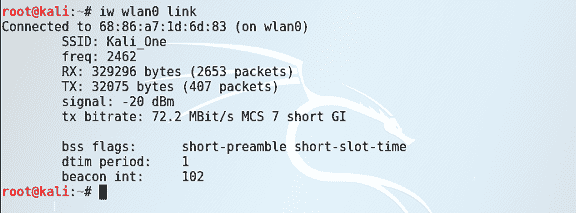

# 破解 WEP 加密

无线管理员意识到开放网络或依赖 MAC 地址认证的网络存在不可接受的风险，因此随着时间的推移，已经有很多尝试来加固无线网络的认证，每种方式都有其局限性：

+   **有线等效隐私**（**WEP**）使用 RC4 加密算法，并将用户定义的密钥与 24 位**初始化向量**（**IV**）结合。不幸的是，IV 会被重用，因此我们可以使用像`aircrack-ng`这样的工具来获取原始密钥，从而让我们作为认证端点访问目标网络。

+   **Wi-Fi 保护接入**（**WPA**）有几种不同的形式，比 WEP 更安全。因为它可以像 WEP 一样使用预共享密钥（WPA-PSK），所以像 fluxion 这样的工具可以恢复预共享密钥，而使用 WPA2 并结合中心身份验证源（通常是 RADIUS）时，则需要使用像`hashcat`这样的工具进行暴力破解（在*获取 WPA/WPA2 密钥*一节中介绍）。

需要注意的是，为了能够恢复预共享密钥，通常需要监控大量的网络流量并将其保存在 PCAP 文件中进行分析，因此在部署系统时，要记住它们可能需要长时间保持不受干扰。

# 准备就绪

为了完成此步骤，你需要遵循本章第一节中列出的命令，将无线网卡设置为监控模式。

你可以通过运行以下命令来确认这一点：

```
root@kali:~/wireless# iw dev
```

确认接口`wlan0mon`已设置为`type monitor`：


# 如何操作……

这是我们用来查找和暴露 WEP 密钥的过程：

1.  根据在*扫描无线网络*部分中进行的扫描，我们知道`Kali_Two`和`Kali_Three`的 SSID 都在`channel 11`上运行 WEP，因此它们将是本节的目标。

1.  使用`airodump-ng`，我们将使用以下命令行从`Kali_Two`开始数据捕获：

```
root@kali:~/wireless# airodump-ng -c 11 --bssid 68:86:A7:1D:6D:84 -w KaliCookbook_8.3 wlan0
```

1.  `-c`参数指定频道（`channel 11`），BSSID 是 AP 的 MAC 地址（`68:86:A7:1D:6D:84`）。我们将把`pcap`文件写入与前面相同的目录，并在`wlan0mon`上进行监听。

1.  一旦启动，收集足够的数据包来暴露 IV 可能需要很长时间——通常在 250,000 到 1,500,000 之间，具体取决于密钥长度。你可以在`airodump-ng`的进度指示器中看到进度，我们会关注`#Data`列：

airodump-ng 进度 如果你想使用已知的有效数据文件来运行`aircrack-ng`，有很多可用的文件，此外，还有更多关于高级`aircrack-ng`的详细信息，访问此地址：[`www.aircrack-ng.org/doku.php?id=aircrack-ng`](https://www.aircrack-ng.org/doku.php?id=aircrack-ng)。

1.  一旦你收集了足够的 IV（初始化向量），可以开始破解过程，使用以下命令启动：

```
root@kali:~/wireless# aircrack-ng -b 68:86:A7:1D:6D:84 KaliCookbook_8.3-01.cap
Opening KaliCookbook_8.3.cap
 Read 563244 packets.

# BSSID             ESSID      Encryption

1 68:86:A7:1D:6D:84            WEP (563244 IVs)

Choosing first network as target.
```

1.  破解 WEP 密钥的过程将开始，具体时间取决于收集的数据量和使用的密钥长度，这可能需要一些时间。然而，完成后，你将看到如下显示：

```
 KEY FOUND! [ kali2 ] 
 Probability: 100%
```

在我们的例子中，WEP 密钥是`kali2`，现在可以直接用来连接到无线网络，作为已认证的终端。

# 获取 WPA/WPA2 密钥

本节将带你了解使用两种不同方法收集 WPA 密钥的过程：

+   通过 SSID 篡改和 fluxion 进行社会工程学攻击

+   使用`hashcat`对收集的数据进行暴力破解

# 准备就绪

为了完成这个操作，你需要按照*扫描无线网络*部分的命令操作，并将无线网卡设置为监听模式。

你可以通过运行以下命令来确认：

```
root@kali:~/wireless# iw dev
```

确认接口`wlan0mon`已设置为`monitor`模式：


# 如何操作...

获取 WPA 受保护网络密码有两种方式；我们将通过以下方式使用 fluxion：

1.  从命令行确保你的无线适配器处于监听模式：

```
root@kali:~/wireless# iw dev
 phy#0
 Interface wlan0
 ifindex 4
 wdev 0x1
 addr 6e:1d:0b:80:36:2b
 type monitor
 channel 13 (2472 MHz), width: 20 MHz (no HT), center1: 2472 MHz
 txpower 20.00 dBm
```

1.  从命令行，我们需要从 Git 下载 fluxion：

```
root@kali:~/wireless# git clone https://github.com/wi-fi-analyzer/fluxion
Cloning into 'fluxion'...
remote: Counting objects: 2646, done.
remote: Total 2646 (delta 0), reused 0 (delta 0), pack-reused 2646
Receiving objects: 100% (2646/2646), 26.13 MiB | 3.44 MiB/s, done.
Resolving deltas: 100% (1444/1444), done.
root@kali:~/wireless#
```

1.  导航到创建的目录（`fluxion/`）并运行以下命令：

```
root@kali:~/wireless/fluxion# ./fluxion.sh
```

如果缺少系统依赖项，你可以运行`./install/installer.sh`文件来确保所有必要的软件包已安装。

1.  一旦所有依赖项都满足，你将看到如下内容：

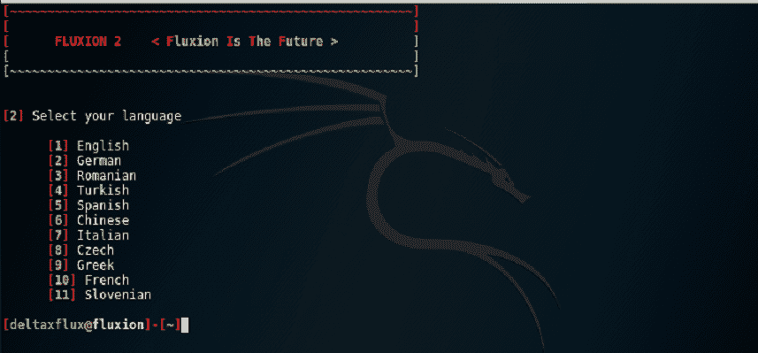Fluxion 启动

1.  在下一个屏幕中，选择你的无线适配器。

1.  接下来，你将被要求选择要监听的频道。由于我们的目标 SSID 在`channel 11`，我们将输入`11`并按*回车*。

1.  下一屏幕将弹出一个额外的终端窗口，标题为`扫描目标`，后面是我们选择的频道，fluxion 将在该频道扫描网络。让其运行几分钟，直到找到你想要破解的 SSID，然后点击右上角的 X 关闭扫描并返回 fluxion 应用程序。

1.  现在，你将看到扫描会话中发现的 SSID 列表，我们需要查找已连接客户端的 SSID。输入列表中的 SSID 编号并按 *Enter*。

1.  选择了 SSID 后，你将有机会选择如何攻击该 SSID。在这种情况下，我们将选择选项`[1] - FakeAP - Hostapd（推荐）`，并按 *Enter*：

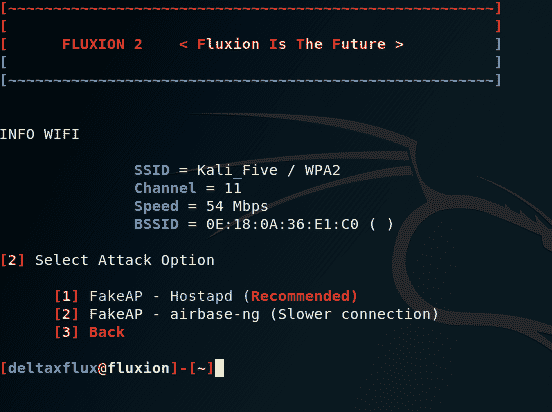选择伪门户方法

1.  现在，系统将提示你输入之前记录的客户端与 AP 之间的握手会话的位置。如果你没有从之前的尝试中保存任何记录，直接按 *Enter*，然后在下一个屏幕上选择`aircrack-ng`选项。

1.  当被询问如何捕获握手时，输入`1`选择“断开所有连接”选项并按 *Enter*。

1.  这将启动两个附加窗口——在右下角，你将看到 fluxion 尝试发送 deauth 数据包，在右上角，你将看到进度。当你看到 ESSID 与客户端之间的数据包时，可以返回 fluxion 窗口，选择选项`[1] 检查握手`并按 *Enter*：

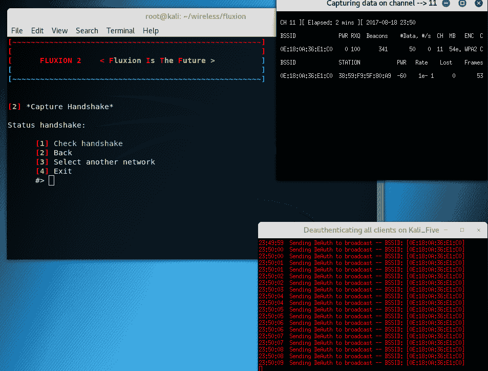使用 fluxion 捕获客户端握手

如果你尚未成功捕获握手，将有选项重新开始捕获过程。

1.  Fluxion 现在将检查是否已配置 SSL 证书用于登录门户。在大多数情况下，选择`创建 SSL 证书`并继续是可以接受的：

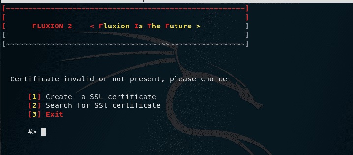选择用于强制门户的证书

1.  下一屏幕将选择`1`选项进入`Web Interface`并继续。

1.  下一屏幕将提供多个不同的门户选项，你可以选择呈现给用户的方式。我们将输入`1`选择`English`并继续。

Fluxion 可以进行高度定制，以展示一个几乎与可用于访客门户的门户相同的页面，等等。这将需要定制门户以满足你的需求。要了解更多关于如何实现这一点的信息，请访问 fluxion 的 Git 代码库：[`github.com/wi-fi-analyzer/fluxion`](https://github.com/wi-fi-analyzer/fluxion)。

1.  Fluxion 现在将在多个终端中启动一系列应用程序，显示其攻击所需进程的统计信息。它将启动一个 DHCP 服务器，一个伪 AP（与目标 SSID 同名，但不受 WPA 保护），一个 DNS 服务器，将所有 DNS 请求强制指向同一 IP 地址的门户，以及生成的 SSID 信息。MDK3 正在运行，以去认证任何试图连接到原始 SSID 的设备，迫使它们连接到我们的 SSID：

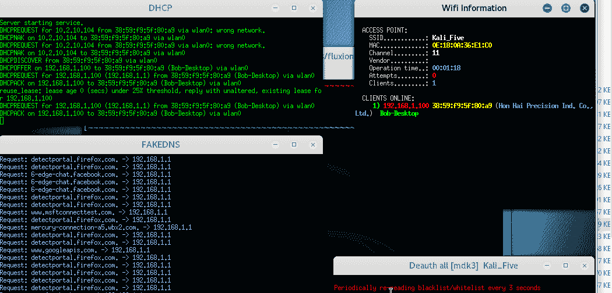Fluxion 攻击的进度

1.  一旦设备被迫连接到我们的 SSID，它们将被重定向到由 fluxion 生成的捕获门户。根据你之前选择的选项或你自定义的门户，它们将被重定向到一个类似以下的门户：

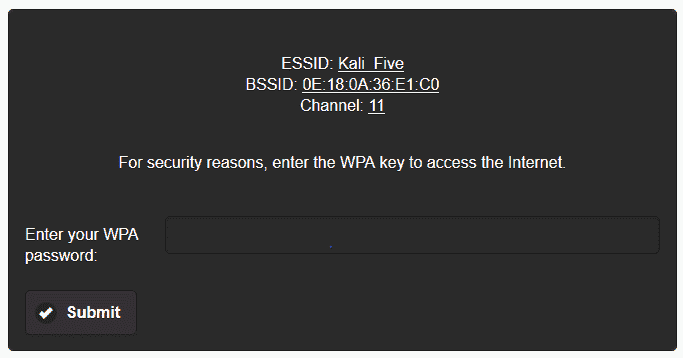捕获门户

1.  当用户看到此屏幕时，他们很可能会输入原始 SSID 的 WPA 密码（在我们的案例中是`Kali_Five`），然后点击提交。当他们这样做时，fluxion 将验证该密码是否为预共享密钥，如果是，fluxion 的进程将停止，你将看到类似以下的屏幕：

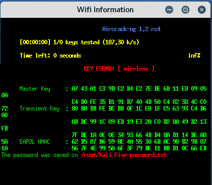识别出的 WPA 密码

1.  如果你认为网络用户不太可能被欺骗提供他们的凭据，你也可以使用`hashcat`对 WPA 密钥执行字典攻击或暴力破解攻击。为此，我们将使用与*破解 WEP 加密*部分相同的数据收集过程，从`Kali_Five` SSID 收集数据：

```
root@kali:~/wireless# airodump-ng -c 11 --bssid OE:18:0A:36:E1:C0 -w KaliCookbook_8.4 wlan0
```

1.  为了加速数据收集过程并捕获更多的握手信息，我们将使用以下命令行向连接到我们 BSSID 的客户端发送 100 次去认证尝试：

```
root@kali:~/wireless# aireplay-ng --deauth 100 -a OE:18:0A:36:E1:C0 -c 38:59:F9:5F:80:A9 wlan0
```

1.  允许`airodump-ng`终端在其自己的终端中继续运行。

1.  Kali Linux 包括一个可以与`hashcat`一起使用的大型词典。Hashcat 是一个多功能的密码暴力破解工具，支持大量格式。在一个单独的终端中，导航到以下目录并解压`rockyou.txt.gz`词典：

```
root@kali:~/wireless# cd /usr/share/wordlists root@kali:usr/share/wordlists# gunzip rockyou.txt.gz 
```

在写本文时，`rockyou.txt`包含了 14,344,392 个不同的词汇。

1.  停止`airodump-ng`进程，并找到`airodump`生成的`cap`文件：

airodump-ng 过程生成的文件

1.  `airodump-ng`生成的文件格式不适合与`hashcat`一起使用，并且 Kali 当前没有转换`cap`文件为`hccapx`格式所需的工具，而`hccapx`是与`hashcat`一起使用所必需的格式。这让你有两种选择：

    +   你可以从 GitHub 仓库下载并编译`cap2hccapx`工具，链接为[`github.com/hashcat/hashcat-utils`](https://github.com/hashcat/hashcat-utils)

    +   你可以将`cap`文件上传到位于[`hashcat.net/cap2hccapx/`](https://hashcat.net/cap2hccapx/)的在线转换工具。

1.  假设你已经将`cap`文件转换为`hccapx`格式，使用前面提到的工具之一，我们现在将使用`rockyou.txt`字典文件通过`hashcat`对该文件进行攻击：

```
root@kali:~/wireless# hashcat -m 2500 -a 0 KaliCookbook_8.4-01.hccapx /usr/share/wordlists/rockyou.txt 
```

该命令行执行以下操作：

`-m 2500`：指示`hashcat`使用 WPA 哈希格式

`-a 0`: 表示我们正在进行基于字典的攻击

1.  一旦`hashcat`从`hccapx`文件中确定了 WPA 密钥，它将在终端窗口中返回结果。正如我们在 fluxion 部分中发现的那样，WPA 密码是`wireless`：


# 利用访客访问

当提供访客访问时，通常它会与你试图渗透的网络处于同一共享网络上。提供的无线访客访问有几种不同类型，每种类型都有自己的漏洞：

1.  预共享密钥：这些通常是 WEP 或 WPA PSK，用来将未授权的用户或设备限制到最小化。不幸的是，这些密钥通常为很多人所知，并且很少被更改。

1.  捕获门户：访客连接到无线网络后，会自动重定向到一个网页，提示他们输入凭证。这可能会与预共享密钥结合使用，也可能不会。

访客访问的最常见实现包括我们在前几部分中做过的那些步骤，但它们是组合在一起的，并且通常会通过它们的 SSID 标记为访客网络。

# 准备就绪

为了完成这个过程，你需要按照*扫描无线网络*一节中列出的命令，将无线网卡设置为监控模式。

你可以通过运行以下命令来确认这一点：

```
root@kali:~/wireless# iw dev
```

确认接口`wlan0mon`已设置为`type monitor`：


# 如何操作...

为了利用带有访客网络的环境，我们将使用以下流程：

1.  首先，我们需要查看哪些网络可能是访客网络。从运行`airodump-ng`开始，如下所示：

```
root@kali:~/wireless# airodump-ng -w KaliCookbook_8.5 wlan0mon
```

 搜索访客网络

1.  根据`airodump-ng`运行的结果，我们可以看到 ESSID `Kali_Guest`是可见的，并且使用共享的 WEP 密钥进行保护，而 ESSID `Kali_Guest1`是开放的。

1.  我们将从开放的 SSID 开始，因为几乎所有访客网络实现都使用访客门户，而且认证会话是通过连接到访客网络的设备的 MAC 地址来跟踪的。为了开始收集该网络节点的信息，我们首先对`Kali_Guest1`的 BSSID 运行`airodump-ng`：

```
root@kali:~/wireless# airodump-ng --bssid 68:86:A7:1D:6D:83 -w KaliCookbook_8.5 wlan0mon
```

1.  正如我们在前面的部分中发现的，这将显示连接到该网络的设备。在这种情况下，我们可能会看到比平时更多的设备，因为许多设备会自动连接到未认证的网络。使用`macchanger`工具伪造这些设备之一，以使用它们的认证会话：

```
root@kali:~/wireless# ifconfig wlan0mon down
root@kali:~/wireless# macchanger -m 7A:DA:38:06:5B:B2 wlan0mon
root@kali:~/wireless# ifconfig wlan0mon up
```

1.  要开始破解 SSID `Kali_Guest` 的 WEP 密钥，让我们启动`airodump-ng`开始收集数据包：

```
root@kali:~/wireless# airodump-ng -c 11 --bssid 68:86:A7:1D:6D:84 -w KaliCookbook_8.5 wlan0mon
```

收集信息以破解访客网络上的 WEP 密钥

1.  正如我们在*破解 WEP 加密*部分所做的那样，我们收集足够的数据包以便能够提取 WEP 密钥，从而访问访客网络。有关如何访问这些类型网络的更详细步骤，请参见*破解 WEP 加密*（如果使用 WEP）或*破解 WPA/WPA2 加密*（如果使用 WPA）部分。

# 恶意接入点部署

在本教程中，我们将使用`wifiphisher`创建一个恶意接入点，并通过模拟企业门户来捕获用户名和密码。

由于我们已经在*破解 WEP 加密*（使用`airodump-ng`/`aircrack-ng`）和*获取 WPA/WPA2 密钥*（使用 fluxion）部分讲解了创建恶意接入点和强制进行去认证，因此本教程将重点介绍创建鼓励开放使用的接入点，并能够收集凭据或传递恶意负载。

# 准备开始

本教程中使用的工具不包含在 Kali Linux 的基础安装中，必须通过命令行使用以下命令安装：

```
root@kali:~/wireless# apt-get install wifiphisher
```

# 如何操作…

要使用`wifiphisher`创建一个恶意接入点，将使用以下过程：

1.  安装完成后，我们将通过以下命令启动`wifiphisher`，该命令将禁用`干扰`（`-nJ`）并创建一个名为`Free Wifi`的 SSID：

```
root@kali:~/wireless# wifiphisher -nJ -e 'Corporate'
```

1.  执行后，系统会要求你选择当受害者连接到我们的 SSID 后将会执行的过程：

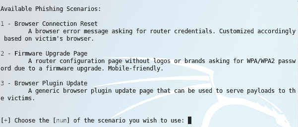 wifiphisher 钓鱼选项

1.  通过输入`1`并按下*Enter*键选择`浏览器连接重置`。

1.  我们现在已经创建了一个开放的无线 SSID，看起来像是一个可以用于多种不同目的的服务。在这种情况下，当连接到此 SSID 时，用户的浏览器会自动重定向到我们在 Kali Linux 系统上运行的 HTTP 服务器，并显示以下页面：

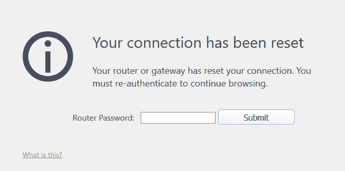使用浏览器重定向模板的强制门户重定向

为了为您设置的任何接入点增加更多的真实性，您可以通过在命令行添加以下内容来定义使用 WPA/WPA2 预共享密钥：`-pK MyKeyHere`。当结合使用共享网络的 PSK（如访客网络或企业网络，其中密钥是静态的但已知）与身份验证登录时，这一点尤其有用。

1.  通过按下*CTRL-C*停止运行的`wifiphisher`会话，停止后，在命令行运行以下命令：

```
root@kali:~/wireless# wifiphisher -nJ -e 'Free WiFi' -p oauth-login
```

与前一步不同，我们已从命令行定义了钓鱼模板。默认模板和自定义模板都可以从命令行调用，从而生成自动化脚本来启动新的攻击。

1.  当你连接到这个 SSID 时，你将被重定向到一个欢迎页面，似乎要求你使用 Facebook 凭证进行身份验证，以接入该网络：

通过捕获门户收集 Facebook 凭证

1.  再次终止上一个会话，我们将通过运行以下命令展示下一个示例：

```
root@kali:~/wireless# wifiphisher -nJ -e 'Asus' -p firmware-upgrade
```

1.  运行此命令将使你能够显示这样的屏幕，提示用户输入他们认为自己连接的网络的 WPA 密码（而不是我们的伪造网络）：

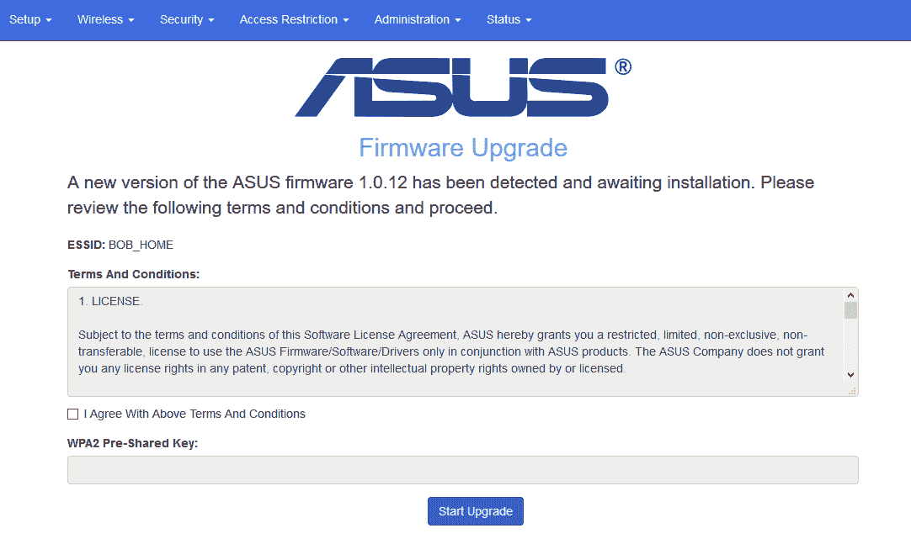固件升级捕获门户示例

1.  最后，终止当前会话并使用以下命令启动`wifiphisher`，它将启动一个新的 SSID，不仅会将用户重定向到我们的门户，还能让我们有机会诱使用户下载我们选择的有效负载，伪装成插件更新：

```
root@kali:~/wireless# wifiphisher -nJ -e 'Guest' -p plugin-update
```

1.  与我们启动的其他会话不同，插件更新模板允许我们定义一个有效负载，诱使用户下载并安装，伪装成浏览器插件的更新。启动后，`wifiphisher`会要求提供你希望定义为有效负载的文件路径。提供该路径后，它将把用户重定向到一个页面，看起来非常像这样：

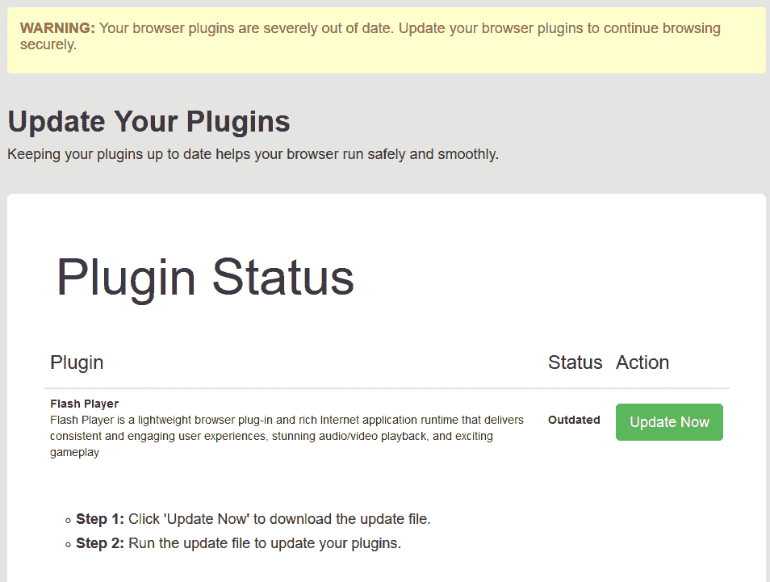插件更新钓鱼门户由于`wifiphisher`使用配置文件作为模板，你可以根据需要创建自己的门户。请查阅该工具主页上的文档：[`wifiphisher.org/`](https://wifiphisher.org/)。

# 使用无线网络扫描内部网络

网络访问是最终目标，使用无线网络意味着这种访问可能比通过远程访问/VPN 或通过物理接入网络端口更容易获得。运用本节中的教程，一旦你获得了网络访问权限，很可能你已经使用了一个授权用户的凭证。下一个问题是：接下来该如何做？

在这个教程中，我们将使用前面章节中学到的一些工具，帮助我们找出扩展当前访问权限的方法。

# 做好准备

本教程假设你已经成功获得了目标无线网络的访问权限，并且具有 IP 连接，最好是通过 DHCP 获取。

# 如何操作…

一旦连接到无线网络，你可以使用以下流程来识别其他目标和易受攻击的系统：

1.  根据目前获得的 IP 信息，查看网络地址方案中是否有任何明显的模式。例如，您在一个子网中获得了一个 IP 地址，但基础设施服务，如 DHCP 和 DNS，则位于不同的子网中。这些子网可能包含包含域用户信息的服务器，如**Active Directory**（**AD**）、**轻量级目录访问协议**（**LDAP**）、集中式数据存储库，如数据库服务器、应用程序服务器等。要查看 DHCP 请求中接收到的信息，请执行以下操作：

```
root@kali:~/wireless# cat /var/lib/dhcp3/dhclient.leases
lease {
 interface "wlan0mon";
 fixed-address 192.168.56.106;
 option subnet-mask 255.255.255.0;
 option dhcp-lease-time 86400;
 option routers 192.168.56.1;
 option dhcp-message-type 5;
 option dhcp-server-identifier 192.168.56.10;
 option domain-name-servers 192.168.56.10;
 option dhcp-renewal-time 43200;
 option dhcp-rebinding-time 75600;
 option host-name "kalicookbook.local";
 renew 0 2017/8/9 05:17:36;
 rebind 0 2017/8/9 15:06:37;
 expire 0 2017/8/9 18:06:37;
}
```

1.  在上述情况下，您可以看到，在客户端网络中，我们从`192.168.56.0/24`网络获得了一个 DHCP 地址，而 DNS 和 DHCP 位于同一网络中。在许多情况下，用户网络和服务器网络是分开的，这会给我们带来两种可能性：

    1.  用户环境可能不太安全，可能是获取凭据等的较好起点。

    1.  服务器环境位于单独的网络上，并且可能已设置访问控制，如防火墙、访问控制网络等。这些控制可能与认证用户使用的服务相关，因此凭据可能是更好的起点。

1.  在命令行中运行`zenmap`。`zenmap`是`Nmap`的图形化前端，能够简化结果的收集和可视化。启动`zenmap`后，输入以下扫描选项并开始扫描。结果应类似于以下屏幕：

使用 zenmap 发现的网络主机

1.  完成后，点击“主机查看器”以获得关于此环境中主机上运行的服务和应用程序的排序、详细视图。如果我们在左侧选择`192.168.56.10`，我们可以看到它很可能是一个 Windows 2008 域控制器：

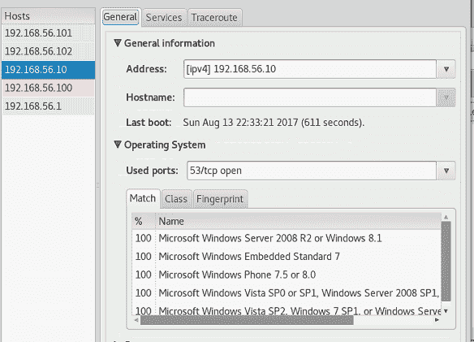使用 zenmap 定位的 Windows 域控制器

1.  确定好目标后，让我们重新打开 OpenVAS，这是我们在第三章中设置的漏洞扫描平台，*漏洞分析*。通过在命令行中输入以下内容来启动 OpenVAS 服务器服务：

```
root@kali:~/wireless# openvas-start
```

1.  打开浏览器，导航到您的 OpenVAS 安装地址，并启动一个新的扫描任务：

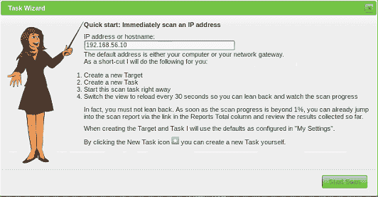新建 OpenVAS 任务：对 192.168.56.10 进行快速扫描

1.  完成后，查看结果以确定是否需要进一步的步骤。有关使用 OpenVAS 和其他漏洞扫描工具的更详细的教程，请参阅第三章，*漏洞分析*。
